# 🧩 PROJECT STRUCTURE SUMMARY
**Generated:** 2025-10-25 11:27:46

## 🚀 APPLICATION OVERVIEW

### Purpose
This application is a **Code Synopsis Annotator** that automatically analyzes Python codebases and generates comprehensive documentation headers. It provides:
- **Automated Code Analysis**: Extracts function signatures, dependencies, and behavioral patterns
- **Intelligent Documentation**: Generates detailed synopsis headers with function intents and signatures
- **Project Architecture Mapping**: Creates high-level project structure documentation
- **LLM-Optimized Output**: Formats information for optimal AI/LLM comprehension

### Key Components
- **Entry Points**: `main.py`
- **Core Analysis**: `analyzer_state.py`, `behavioral_analysis.py`, `core_analyzer.py`
- **User Interface**: `synopsis_renderer.py`
- **Utilities**: `utils.py`

### Architecture Summary
- **Total Modules**: 14
- **Total Functions**: 181
- **Total Classes**: 13

### Key Features
- Behavioral Analysis
- Content Generation
- Dependency Mapping
- Documentation Generation
- Function Signature Extraction
- State Machine Detection
- Threading Analysis

---

## 🚪 ENTRY POINTS

### Primary Entry Points
- **`main.py`**: Main application entry point and orchestration.
  - Entry functions: `main()`

### Batch Processing Entry Points
- **`batch_annotate_modular.py`**: Manages concurrent execution. Processes various components.
  - Batch functions: `_process_folder, _process_single, process_batch, process_single_file, run_batch()`

### Utility Scripts
- **`file_io.py`**: Creates and manages user interface components. Creates various components.
- **`intent_enhancer_v2.py`**: Detects or identifies patterns in, Generates functionality for this module.
- **`project_architect.py`**: Generates, Extracts functionality for this module.

### Execution Flow
1. **Start**: Run `python main.py` or `python main.py <filepath>`
2. **Analysis**: Core analyzer processes the Python file
3. **Behavioral Analysis**: Extracts patterns and intents
4. **Rendering**: Generates synopsis headers
5. **Output**: Creates annotated file with documentation

### Command Line Usage
```bash
# Interactive mode (file dialog)
python main.py

# Direct file analysis
python main.py path/to/file.py

# Batch processing
python batch_annotate_modular.py

# Generate project structure
python project_architect.py
```

---

## 🔄 SHARED STATE TABLE

| File | Variable | Modified By | Read By |
|------|----------|-------------|---------|
| batch_annotate_modular.py | `files` | _process_folder, find_python_files, process_single_file | _process_folder, find_python_files |
| state_machine_detector.py | `detector` | detect_state_machines, generate_state_machine_diagram, render_state_machine_summary | detect_state_machines, generate_state_machine_diagram, render_state_machine_summary |
| state_machine_detector.py | `from_state` | _analyze_transitions, generate_mermaid_diagram | _analyze_transitions, generate_mermaid_diagram |
| state_machine_detector.py | `to_state` | _analyze_transitions, generate_mermaid_diagram | _analyze_transitions, generate_mermaid_diagram |
| state_machine_detector.py | `var_type` | _classify_state_variable, _detect_state_variables | _classify_state_variable, _detect_state_variables |

---

This document provides a full architectural map of the project.

## 🧱 Module Dependency Graph

```mermaid
graph TD
    __init__.py --> behavioral_analysis
    __init__.py --> core_analyzer
    __init__.py --> file_io
    __init__.py --> intent_inference
    __init__.py --> synopsis_renderer
    __init__.py --> utils
    batch_annotate_modular.py --> analyzer_state
    batch_annotate_modular.py --> behavioral_analysis
    batch_annotate_modular.py --> core_analyzer
    batch_annotate_modular.py --> intent_inference
    batch_annotate_modular.py --> project_architect
    batch_annotate_modular.py --> synopsis_renderer
    core_analyzer.py --> analyzer_state
    core_analyzer.py --> state_machine_detector
    file_io.py --> behavioral_analysis
    file_io.py --> core_analyzer
    file_io.py --> synopsis_renderer
    intent_enhancer_v2.py --> intent_inference
    intent_inference.py --> intent_enhancer_v2
    main.py --> analyzer_state
    project_architect.py --> state_tracker
```



## 🔄 Cross-Module Data Flow Map

| Source Module | Target or Description |
|----------------|----------------------|
| analyzer_state.py | Functions: clear, merge, new_state, summary, to_dict, to_json, update |
| batch_annotate_modular.py | Functions: __init__, _build_ui, _process_folder, _process_single, _run, compute_code_hash, extract_existing_hash, find_python_files, format_duration, generate_markdown, get_code_body, is_up_to_date, log, make_ba... |
| behavioral_analysis.py | Functions: __init__, analyze_function_dependencies, analyze_high_priority_functions, build_machine_block, categorize_shared_state, dfs, generate_behavioral_summary, group_modules_generic, render_call_hierarchy, ... |
| core_analyzer.py | Functions: __init__, _analyze_function_accesses, _call_to_name, _collect_params, _enclosing_function_name, _enter_func, _exit_func, _extract_open_args, _format_call_name, _is_local_module, _is_true_global, _name... |
| file_io.py | Functions: __init__, analyze_file, batch_analyze_files, create_annotated_file, get_analysis_summary, main, select_file_and_analyze |
| intent_enhancer_v2.py | Functions: __init__, detect_domains, detect_function_patterns, extract_noun_from_functions, find_common_themes, generate_enhanced_module_intent, generate_smart_intent |
| intent_inference.py | Functions: _infer_verb, _insert_human_readable_intent, _insert_machine_block_kv, _noun_phrase_from, _split_ident, generate_module_intent, infer_function_intent, inject_intent |
| main.py | Functions: analyze_file, batch_analyze, main |
| project_architect.py | Functions: build_project_summary, detect_exceptions, extract, extract_function_signatures_from_content, extract_list, generate_application_overview, generate_detailed_shared_state_table, generate_entry_points_se... |
| state_machine_detector.py | Functions: __init__, _analyze_transitions, _build_function_map, _classify_state_variable, _detect_guards, _detect_state_variables, _extract_name, _extract_value, _get_enclosing_function, _group_into_state_machin... |
| state_tracker.py | Functions: _strip_comment_prefix, append_to_project_structure, build_state_table, extract_blocks, extract_critical_globals, generate_state_markdown, merge_file_state_from_text, parse_block |
| synopsis_renderer.py | Functions: __init__, _render_classes, _render_critical_globals, _render_data_flow_summary, _render_function_behavioral_summaries, _render_function_dependencies, _render_function_signatures, _render_high_priority... |
| utils.py | Functions: call_to_name, categorize_shared_state, enclosing_function_name, extract_hotkey_bindings, extract_open_args, format_call_name, format_file_size, get_file_info, group_functions_by_purpose, is_local_modu... |

## 📦 Module Summaries

### `__init__.py`

**Intent:** Handles init functionality.

**Classes:** _None_

**Functions:** _None_

**Globals:** __all__, __author__, __version__


**Local Imports:** behavioral_analysis, core_analyzer, file_io, intent_inference, synopsis_renderer, utils

**External Imports:** importlib, sys


#### 📝 Function Signatures

_No function signatures available._


#### 🎯 Function Intents

_No function intents available._


#### File I/O Summary

- Reads: _None_

- Writes: _None_


#### Threading & UI Bindings

- Threads: _None_

- UI Binds: _None_


#### Exception Paths

_No exception handlers detected._


---

### `analyzer_state.py`

**Intent:** Loads and manages configuration settings.

**Classes:** AnalyzerState

**Functions:** clear, merge, new_state, summary, to_dict, to_json, update

**Globals:** _lock, classes, config_state, exceptions, functions, generated_at, globals, hotkeys, imports_external, imports_local, io_reads, io_writes, notes, position_state, project_path, state, state_cats, threads, timing_state, ui_binds, version


**Local Imports:** _None_

**External Imports:** __future__, dataclasses, datetime, json, threading, typing


#### 📝 Function Signatures

- `AnalyzerState.clear(self) -> None`

- `AnalyzerState.merge(self, other: AnalyzerState) -> None`

- `AnalyzerState.summary(self) -> str`

- `AnalyzerState.to_dict(self) -> Dict[str, Any]`

- `AnalyzerState.to_json(self, path: str) -> None`

- `AnalyzerState.update(self, key: str, value: Any) -> None`

- `new_state(project_path: Optional[str] = None) -> AnalyzerState`


#### 🎯 Function Intents

- **clear()**: Handles the target entities.

- **merge()**: Handles the target entities.

- **new_state()**: Handles state.

- **summary()**: Handles the target entities.

- **to_dict()**: Handles dict.

- **to_json()**: Handles json.

- **update()**: Handles the target entities.


#### File I/O Summary

- Reads: _None_

- Writes: json.dump(...)


#### Threading & UI Bindings

- Threads: _None_

- UI Binds: _None_


#### Exception Paths

_No exception handlers detected._


---

### `batch_annotate_modular.py`

**Intent:** Manages concurrent execution. Processes various components.

**Classes:** AnnotatorGUI

**Functions:** __init__, _build_ui, _process_folder, _process_single, _run, compute_code_hash, extract_existing_hash, find_python_files, format_duration, generate_markdown, get_code_body, is_up_to_date, log, make_backup, open_folder, open_folder_in_explorer, process_batch, process_single_file, run_batch, run_in_thread, run_single, select_file, select_folder, strip_all_annotations

**Globals:** ANNOTATOR_VERSION, HEADER_BOUNDARY, app, args, files, parser, project_structure_path, root, state_map, state_table


**Local Imports:** analyzer_state, behavioral_analysis, core_analyzer, intent_inference, project_architect, synopsis_renderer

**External Imports:** argparse, datetime, glob, hashlib, os, pathlib, shutil, subprocess, sys, threading, tkinter


#### 📝 Function Signatures

- `AnnotatorGUI.__init__(self, root) -> None`

- `AnnotatorGUI._build_ui(self) -> None`

- `AnnotatorGUI._process_folder(self, folder) -> None`

- `AnnotatorGUI._process_single(self, path) -> None`

- `AnnotatorGUI.generate_markdown(self) -> None`

- `AnnotatorGUI.log(self, msg, tag = None) -> None`

- `AnnotatorGUI.open_folder(self) -> None`

- `AnnotatorGUI.run_batch(self) -> None`

- `AnnotatorGUI.run_in_thread(self, fn) -> None`

- `AnnotatorGUI.run_single(self) -> None`

- `AnnotatorGUI.select_file(self) -> None`

- `AnnotatorGUI.select_folder(self) -> None`

- `compute_code_hash(code_text: str) -> str`

- `extract_existing_hash(file_path: str) -> None`

- `find_python_files(directory_path, recursive = False, skip_patterns = None) -> None`

- `format_duration(seconds) -> None`

- `get_code_body(file_path: str) -> None`

- `is_up_to_date(file_path) -> None`

- `make_backup(file_path) -> None`

- `open_folder_in_explorer(path) -> None`

- `Open folder in file explorer (cross-platform).`

- `process_batch(files, dry_run = False, backup = True, skip_annotated = False, force_rewrite = False) -> None`

- `process_single_file(file_path, dry_run = False, backup = True, force_rewrite = False) -> None`

- `strip_all_annotations(file_path) -> None`


#### 🎯 Function Intents

- **__init__()**: Handles the target entities.

- **_build_ui()**: Constructs or generates ui.

- **_process_folder()**: Handles or executes folder.

- **_process_single()**: Handles or executes single.

- **_run()**: Handles the target entities.

- **compute_code_hash()**: Handles code hash.

- **extract_existing_hash()**: Retrieves existing hash.

- **find_python_files()**: Locates or gathers python files.

- **format_duration()**: Handles duration.

- **generate_markdown()**: Handles markdown.

- **get_code_body()**: Handles code body.

- **is_up_to_date()**: Handles up to date.

- **log()**: Handles the target entities.

- **make_backup()**: Handles backup.

- **open_folder()**: Handles folder.

- **open_folder_in_explorer()**: Handles folder in explorer.

- **process_batch()**: Handles or executes batch.

- **process_single_file()**: Handles or executes single file.

- **run_batch()**: Handles batch.

- **run_in_thread()**: Handles in thread.

- **run_single()**: Handles single.

- **select_file()**: Handles file.

- **select_folder()**: Handles folder.

- **strip_all_annotations()**: Handles all annotations.


#### File I/O Summary

- Reads: _None_

- Writes: _None_


#### Threading & UI Bindings

- Threads: fn

- UI Binds: _None_


#### Exception Paths

_No exception handlers detected._


---

### `behavioral_analysis.py`

**Intent:** Renders, Analyzes functionality for this module.

**Classes:** BehavioralAnalyzer

**Functions:** __init__, analyze_function_dependencies, analyze_high_priority_functions, build_machine_block, categorize_shared_state, dfs, generate_behavioral_summary, group_modules_generic, render_call_hierarchy, render_state_machines, render_ui_after_usage

**Globals:** _None_


**Local Imports:** _None_

**External Imports:** ast, collections, datetime, typing


#### 📝 Function Signatures

- `BehavioralAnalyzer.__init__(self, analyzer, state = None) -> None`

- `BehavioralAnalyzer.analyze_function_dependencies(self) -> List[Tuple[str, List[str]]]`

- `Analyze functions with high fan-out (calling many other functions).`

- `BehavioralAnalyzer.analyze_high_priority_functions(self) -> List[Tuple[str, Dict, Set[str], Set[str]]]`

- `BehavioralAnalyzer.build_machine_block(self) -> List[str]`

- `BehavioralAnalyzer.categorize_shared_state(self) -> List[Tuple[str, List[str]]]`

- `BehavioralAnalyzer.generate_behavioral_summary(self) -> List[str]`

- `BehavioralAnalyzer.group_modules_generic(self) -> Dict[str, List[str]]`

- `BehavioralAnalyzer.render_call_hierarchy(self, max_depth: int = 3, max_children: int = 8) -> List[str]`

- `BehavioralAnalyzer.render_state_machines(self) -> List[str]`

- `BehavioralAnalyzer.render_ui_after_usage(self) -> List[str]`


#### 🎯 Function Intents

- **__init__()**: Handles the target entities.

- **analyze_function_dependencies()**: Examines and summarizes function dependencies.

- **analyze_high_priority_functions()**: Examines and summarizes high priority functions.

- **build_machine_block()**: Constructs or generates machine block.

- **categorize_shared_state()**: Handles shared state.

- **dfs()**: Handles the target entities.

- **generate_behavioral_summary()**: Handles behavioral summary.

- **group_modules_generic()**: Organizes modules generic.

- **render_call_hierarchy()**: Produces or displays call hierarchy.

- **render_state_machines()**: Produces or displays state machines.

- **render_ui_after_usage()**: Produces or displays ui after usage.


#### File I/O Summary

- Reads: _None_

- Writes: _None_


#### Threading & UI Bindings

- Threads: _None_

- UI Binds: _None_


#### Exception Paths

_No exception handlers detected._


---

### `core_analyzer.py`

**Intent:** Locates or discovers, Extracts functionality for this module.

**Classes:** CodeAnalyzer, GlobalAccessVisitor, ScopeIndexer

**Functions:** __init__, _analyze_function_accesses, _call_to_name, _collect_params, _enclosing_function_name, _enter_func, _exit_func, _extract_open_args, _format_call_name, _is_local_module, _is_true_global, _names_in_target, _render_arg, _safe_unparse, analyze, analyze_classes, analyze_functions, build_call_graph, build_symbol_indexes, detect_state_machines, detect_ui_after_usage, extract_call_graph, extract_function_signatures, extract_hotkey_bindings, extract_state_transitions, find_file_io, find_globals, find_hotkeys_and_ui_binds, find_imports, find_threading, infer_function_behavior, map_global_accesses, parse_code, process_function, read_file, strip_existing_synopsis, summarize_initialization_sequence, visit_AnnAssign, visit_Assign, visit_AsyncFunctionDef, visit_AugAssign, visit_ExceptHandler, visit_For, visit_FunctionDef, visit_Global, visit_Import, visit_ImportFrom, visit_Name, visit_Nonlocal, visit_With

**Globals:** _None_


**Local Imports:** analyzer_state, state_machine_detector

**External Imports:** ast, collections, os, typing, warnings


#### 📝 Function Signatures

- `CodeAnalyzer.__init__(self, filepath: str, state = None, *, include_machine_block: bool = True) -> None`

- `CodeAnalyzer._analyze_function_accesses(self, func_node: ast.AST, func_name: str) -> None`

- `CodeAnalyzer._call_to_name(self, func_node) -> str`

- `CodeAnalyzer._enclosing_function_name(self, node: ast.AST) -> Optional[str]`

- `CodeAnalyzer._extract_open_args(self, call_node: ast.Call) -> Tuple[Optional[str], str]`

- `Extract file path and mode from open() call.`

- `CodeAnalyzer._format_call_name(self, call_node: ast.Call) -> str`

- `CodeAnalyzer._is_local_module(self, module_name: str) -> bool`

- `CodeAnalyzer._render_arg(self, arg: ast.arg, default: Optional[ast.AST]) -> str`

- `CodeAnalyzer._safe_unparse(self, node: Optional[ast.AST]) -> str`

- `CodeAnalyzer.analyze(self) -> None`

- `CodeAnalyzer.analyze_classes(self) -> None`

- `CodeAnalyzer.analyze_functions(self) -> None`

- `CodeAnalyzer.build_call_graph(self) -> None`

- `CodeAnalyzer.build_symbol_indexes(self) -> None`

- `CodeAnalyzer.detect_state_machines(self) -> None`

- `CodeAnalyzer.detect_ui_after_usage(self) -> None`

- `CodeAnalyzer.extract_call_graph(self, tree: ast.AST) -> Dict[str, Set[str]]`

- `CodeAnalyzer.extract_function_signatures(self) -> None`

- `CodeAnalyzer.extract_hotkey_bindings(self) -> List[str]`

- `CodeAnalyzer.extract_state_transitions(self, tree: ast.AST) -> Dict[str, Set[str]]`

- `CodeAnalyzer.find_file_io(self) -> None`

- `CodeAnalyzer.find_globals(self) -> None`

- `CodeAnalyzer.find_hotkeys_and_ui_binds(self) -> None`

- `CodeAnalyzer.find_imports(self) -> None`

- `CodeAnalyzer.find_threading(self) -> None`

- `CodeAnalyzer.infer_function_behavior(self, func_name: str) -> Dict[str, object]`

- `CodeAnalyzer.map_global_accesses(self) -> None`

- `CodeAnalyzer.parse_code(self) -> None`

- `CodeAnalyzer.read_file(self) -> str`

- `CodeAnalyzer.strip_existing_synopsis(self, code: str) -> str`

- `CodeAnalyzer.summarize_initialization_sequence(self) -> None`

- `GlobalAccessVisitor.__init__(self, module_assigned: Set[str], module_imported: Set[str], func_params: Set[str], func_locals: Set[str], func_globals_declared: Set[str]) -> None`

- `GlobalAccessVisitor._is_true_global(self, name: str) -> bool`

- `GlobalAccessVisitor.visit_Name(self, node: ast.Name) -> None`

- `ScopeIndexer.__init__(self) -> None`

- `ScopeIndexer._collect_params(self, node: ast.AST) -> Set[str]`

- `ScopeIndexer._enter_func(self, name: str, node: ast.AST) -> None`

- `ScopeIndexer._exit_func(self) -> None`

- `ScopeIndexer.visit_AnnAssign(self, node: ast.AnnAssign) -> None`

- `ScopeIndexer.visit_Assign(self, node: ast.Assign) -> None`

- `ScopeIndexer.visit_AsyncFunctionDef(self, node: ast.AsyncFunctionDef) -> None`

- `ScopeIndexer.visit_AugAssign(self, node: ast.AugAssign) -> None`

- `ScopeIndexer.visit_ExceptHandler(self, node: ast.ExceptHandler) -> None`

- `ScopeIndexer.visit_For(self, node: ast.For) -> None`

- `ScopeIndexer.visit_FunctionDef(self, node: ast.FunctionDef) -> None`

- `ScopeIndexer.visit_Global(self, node: ast.Global) -> None`

- `ScopeIndexer.visit_Import(self, node: ast.Import) -> None`

- `ScopeIndexer.visit_ImportFrom(self, node: ast.ImportFrom) -> None`

- `ScopeIndexer.visit_Name(self, node: ast.Name) -> None`

- `ScopeIndexer.visit_Nonlocal(self, node: ast.Nonlocal) -> None`

- `ScopeIndexer.visit_With(self, node: ast.With) -> None`

- `_names_in_target(target: ast.AST) -> Set[str]`


#### 🎯 Function Intents

- **__init__()**: Handles the target entities.

- **_analyze_function_accesses()**: Examines and summarizes function accesses.

- **_call_to_name()**: Handles to name.

- **_collect_params()**: Handles params.

- **_enclosing_function_name()**: Handles function name.

- **_enter_func()**: Handles func.

- **_exit_func()**: Handles func.

- **_extract_open_args()**: Retrieves open args.

- **_format_call_name()**: Handles call name.

- **_is_local_module()**: Handles local module.

- **_is_true_global()**: Handles true global.

- **_names_in_target()**: Handles in target.

- **_render_arg()**: Produces or displays arg.

- **_safe_unparse()**: Handles unparse.

- **analyze()**: Examines and summarizes the target entities.

- **analyze_classes()**: Examines and summarizes classes.

- **analyze_functions()**: Examines and summarizes functions.

- **build_call_graph()**: Constructs or generates call graph.

- **build_symbol_indexes()**: Constructs or generates symbol indexes.

- **detect_state_machines()**: Identifies state machines.

- **detect_ui_after_usage()**: Identifies ui after usage.

- **extract_call_graph()**: Retrieves call graph.

- **extract_function_signatures()**: Retrieves function signatures.

- **extract_hotkey_bindings()**: Retrieves hotkey bindings.

- **extract_state_transitions()**: Retrieves state transitions.

- **find_file_io()**: Locates or gathers file io.

- **find_globals()**: Locates or gathers globals.

- **find_hotkeys_and_ui_binds()**: Locates or gathers hotkeys and ui binds.

- **find_imports()**: Locates or gathers imports.

- **find_threading()**: Locates or gathers threading.

- **infer_function_behavior()**: Handles function behavior.

- **map_global_accesses()**: Handles global accesses.

- **parse_code()**: Parses code.

- **process_function()**: Handles or executes function.

- **read_file()**: Reads file.

- **strip_existing_synopsis()**: Handles existing synopsis.

- **summarize_initialization_sequence()**: Condenses results of initialization sequence.

- **visit_AnnAssign()**: Handles ann assign.

- **visit_Assign()**: Handles assign.

- **visit_AsyncFunctionDef()**: Handles async function def.

- **visit_AugAssign()**: Handles aug assign.

- **visit_ExceptHandler()**: Handles except handler.

- **visit_For()**: Handles for.

- **visit_FunctionDef()**: Handles function def.

- **visit_Global()**: Handles global.

- **visit_Import()**: Handles import.

- **visit_ImportFrom()**: Handles import from.

- **visit_Name()**: Handles name.

- **visit_Nonlocal()**: Handles nonlocal.

- **visit_With()**: Handles with.


#### File I/O Summary

- Reads: _None_

- Writes: _None_


#### Threading & UI Bindings

- Threads: _None_

- UI Binds: _None_


#### Exception Paths

_No exception handlers detected._


---

### `file_io.py`

**Intent:** Creates and manages user interface components. Creates various components.

**Classes:** FileIOHandler

**Functions:** __init__, analyze_file, batch_analyze_files, create_annotated_file, get_analysis_summary, main, select_file_and_analyze

**Globals:** _None_


**Local Imports:** behavioral_analysis, core_analyzer, synopsis_renderer

**External Imports:** os, sys, time, tkinter, traceback, typing


#### 📝 Function Signatures

- `FileIOHandler.__init__(self) -> None`

- `FileIOHandler.analyze_file(self, filepath: str) -> bool`

- `FileIOHandler.batch_analyze_files(self, filepaths: list) -> dict`

- `FileIOHandler.create_annotated_file(self, analyzer: CodeAnalyzer, output_path: str) -> None`

- `FileIOHandler.get_analysis_summary(self, analyzer: CodeAnalyzer) -> dict`

- `FileIOHandler.select_file_and_analyze(self) -> None`

- `main() -> None`


#### 🎯 Function Intents

- **__init__()**: Handles the target entities.

- **analyze_file()**: Examines and summarizes file.

- **batch_analyze_files()**: Examines and summarizes files.

- **create_annotated_file()**: Handles annotated file.

- **get_analysis_summary()**: Handles analysis summary.

- **main()**: Handles the target entities.

- **select_file_and_analyze()**: Handles file and.


#### File I/O Summary

- Reads: _None_

- Writes: _None_


#### Threading & UI Bindings

- Threads: _None_

- UI Binds: _None_


#### Exception Paths

_No exception handlers detected._


---

### `intent_enhancer_v2.py`

**Intent:** Detects or identifies patterns in, Generates functionality for this module.

**Classes:** _None_

**Functions:** __init__, detect_domains, detect_function_patterns, extract_noun_from_functions, find_common_themes, generate_enhanced_module_intent, generate_smart_intent

**Globals:** DOMAIN_INDICATORS, DOMAIN_PURPOSES, FUNCTION_PATTERNS, MODULE_NAME_HINTS, analyzer1, analyzer2, analyzer3, analyzer4, analyzer5, analyzer6, analyzer7, analyzer8


**Local Imports:** intent_inference

**External Imports:** re, typing


#### 📝 Function Signatures

- `detect_domains(imports_external: List[str]) -> Set[str]`

- `detect_function_patterns(function_names: List[str]) -> Dict[str, int]`

- `extract_noun_from_functions(function_names: List[str]) -> List[str]`

- `find_common_themes(nouns: List[str]) -> List[str]`

- `generate_enhanced_module_intent(analyzer, filename: Optional[str] = None, imports_external: Optional[List[str]] = None) -> str`

- `generate_smart_intent(analyzer) -> str`

- `Drop-in replacement for generate_module_intent() from intent_inference.py`


#### 🎯 Function Intents

- **__init__()**: Handles the target entities.

- **detect_domains()**: Identifies domains.

- **detect_function_patterns()**: Identifies function patterns.

- **extract_noun_from_functions()**: Retrieves noun from functions.

- **find_common_themes()**: Locates or gathers common themes.

- **generate_enhanced_module_intent()**: Handles enhanced module intent.

- **generate_smart_intent()**: Handles smart intent.


#### File I/O Summary

- Reads: _None_

- Writes: _None_


#### Threading & UI Bindings

- Threads: _None_

- UI Binds: _None_


#### Exception Paths

_No exception handlers detected._


---

### `intent_inference.py`

**Intent:** Generates functionality for this module.

**Classes:** _None_

**Functions:** _infer_verb, _insert_human_readable_intent, _insert_machine_block_kv, _noun_phrase_from, _split_ident, generate_module_intent, infer_function_intent, inject_intent

**Globals:** ACTION_MAP, DEFAULT_MODULE_INTENT, DEFAULT_VERB


**Local Imports:** intent_enhancer_v2

**External Imports:** __future__, re, typing


#### 📝 Function Signatures

- `_infer_verb(tokens: List[str]) -> Tuple[str, str]`

- `_insert_human_readable_intent(header_text: str, human_intent: str) -> str`

- `Insert a '# INTENT: ...' line near the top (after SYNOPSIS_HASH if present).`

- `_insert_machine_block_kv(header_text: str, key: str, value: str) -> str`

- `_noun_phrase_from(tokens: List[str], skip_first: bool = True) -> str`

- `_split_ident(name: str) -> List[str]`

- `generate_module_intent(analyzer) -> str`

- `infer_function_intent(func_name: str) -> str`

- `inject_intent(header_text: str, analyzer, behavioral_analyzer) -> str`


#### 🎯 Function Intents

- **_infer_verb()**: Handles verb.

- **_insert_human_readable_intent()**: Handles human readable intent.

- **_insert_machine_block_kv()**: Handles machine block kv.

- **_noun_phrase_from()**: Handles phrase from.

- **_split_ident()**: Handles ident.

- **generate_module_intent()**: Handles module intent.

- **infer_function_intent()**: Handles function intent.

- **inject_intent()**: Handles intent.


#### File I/O Summary

- Reads: _None_

- Writes: _None_


#### Threading & UI Bindings

- Threads: _None_

- UI Binds: _None_


#### Exception Paths

_No exception handlers detected._


---

### `main.py`

**Intent:** Main application entry point and orchestration.

**Classes:** _None_

**Functions:** analyze_file, batch_analyze, main

**Globals:** _None_


**Local Imports:** analyzer_state

**External Imports:** code_synopsis_annotator.behavioral_analysis, code_synopsis_annotator.core_analyzer, code_synopsis_annotator.file_io, code_synopsis_annotator.synopsis_renderer, os, sys, typing


#### 📝 Function Signatures

- `analyze_file(filepath: str, include_machine_block: bool = True) -> Optional[dict]`

- `batch_analyze(files: list, include_machine_block: bool = True) -> dict`

- `main() -> None`


#### 🎯 Function Intents

- **analyze_file()**: Examines and summarizes file.

- **batch_analyze()**: Examines and summarizes the target entities.

- **main()**: Handles the target entities.


#### File I/O Summary

- Reads: _None_

- Writes: _None_


#### Threading & UI Bindings

- Threads: _None_

- UI Binds: _None_


#### Exception Paths

_No exception handlers detected._


---

### `project_architect.py`

**Intent:** Generates, Extracts functionality for this module.

**Classes:** _None_

**Functions:** build_project_summary, detect_exceptions, extract, extract_function_signatures_from_content, extract_list, generate_application_overview, generate_detailed_shared_state_table, generate_entry_points_section, parse_function_intents

**Globals:** folder, path


**Local Imports:** state_tracker

**External Imports:** collections, datetime, os, re


#### 📝 Function Signatures

- `build_project_summary(folder: str, output_path: str = None) -> str`

- `detect_exceptions(content: str) -> list[str]`

- `extract(block: str, key: str) -> str`

- `extract_function_signatures_from_content(content: str) -> list[str]`

- `extract_list(block: str, key: str) -> list[str]`

- `generate_application_overview(summaries: list[dict]) -> list[str]`

- `generate_detailed_shared_state_table(folder: str) -> list[str]`

- `generate_entry_points_section(summaries: list[dict]) -> list[str]`

- `parse_function_intents(function_intents_str: str) -> dict[str, str]`


#### 🎯 Function Intents

- **build_project_summary()**: Constructs or generates project summary.

- **detect_exceptions()**: Identifies exceptions.

- **extract()**: Retrieves the target entities.

- **extract_function_signatures_from_content()**: Retrieves function signatures from content.

- **extract_list()**: Retrieves list.

- **generate_application_overview()**: Handles application overview.

- **generate_detailed_shared_state_table()**: Handles detailed shared state table.

- **generate_entry_points_section()**: Handles entry points section.

- **parse_function_intents()**: Parses function intents.


#### File I/O Summary

- Reads: _None_

- Writes: _None_


#### Threading & UI Bindings

- Threads: _None_

- UI Binds: _None_


#### Exception Paths

_No exception handlers detected._


---

### `state_machine_detector.py`

**Intent:** Generates, Renders functionality for this module.

**Classes:** StateMachine, StateMachineDetector, StateTransition, StateVariable

**Functions:** __init__, _analyze_transitions, _build_function_map, _classify_state_variable, _detect_guards, _detect_state_variables, _extract_name, _extract_value, _get_enclosing_function, _group_into_state_machines, _infer_source_states, _matches_variable, detect, detect_state_machines, generate_mermaid_diagram, generate_state_machine_diagram, render_state_machine_summary, render_summary

**Globals:** STATE_VARIABLE_PATTERNS, analyzer, comparisons, condition, detector, from_state, line_number, name, primary_variable, readers, related_variables, results, states, test_code, to_state, transitions, trigger_function, values, var_type, writers


**Local Imports:** _None_

**External Imports:** ast, collections, dataclasses, re, typing


#### 📝 Function Signatures

- `StateMachineDetector.__init__(self, analyzer) -> None`

- `StateMachineDetector._analyze_transitions(self) -> None`

- `Analyze state transitions (assignments to state variables).`

- `StateMachineDetector._build_function_map(self) -> None`

- `StateMachineDetector._classify_state_variable(self, var_name: str) -> Optional[str]`

- `StateMachineDetector._detect_guards(self) -> None`

- `Detect guard conditions (if statements checking state).`

- `StateMachineDetector._detect_state_variables(self) -> None`

- `StateMachineDetector._extract_name(self, node: ast.AST) -> Optional[str]`

- `StateMachineDetector._extract_value(self, node: ast.AST) -> Optional[str]`

- `StateMachineDetector._get_enclosing_function(self, node: ast.AST) -> Optional[str]`

- `StateMachineDetector._group_into_state_machines(self) -> None`

- `StateMachineDetector._infer_source_states(self, func_node: ast.FunctionDef, var_name: str, assignment_node: ast.Assign) -> List[str]`

- `StateMachineDetector._matches_variable(self, state_value: str, var_name: str) -> bool`

- `StateMachineDetector.detect(self) -> Dict[str, any]`

- `StateMachineDetector.generate_mermaid_diagram(self) -> str`

- `StateMachineDetector.render_summary(self) -> List[str]`

- `detect_state_machines(analyzer) -> Dict[str, any]`

- `generate_state_machine_diagram(analyzer) -> str`

- `render_state_machine_summary(analyzer) -> List[str]`


#### 🎯 Function Intents

- **__init__()**: Handles the target entities.

- **_analyze_transitions()**: Examines and summarizes transitions.

- **_build_function_map()**: Constructs or generates function map.

- **_classify_state_variable()**: Handles state variable.

- **_detect_guards()**: Identifies guards.

- **_detect_state_variables()**: Identifies state variables.

- **_extract_name()**: Retrieves name.

- **_extract_value()**: Retrieves value.

- **_get_enclosing_function()**: Handles enclosing function.

- **_group_into_state_machines()**: Organizes into state machines.

- **_infer_source_states()**: Handles source states.

- **_matches_variable()**: Handles variable.

- **detect()**: Identifies the target entities.

- **detect_state_machines()**: Identifies state machines.

- **generate_mermaid_diagram()**: Handles mermaid diagram.

- **generate_state_machine_diagram()**: Handles state machine diagram.

- **render_state_machine_summary()**: Produces or displays state machine summary.

- **render_summary()**: Produces or displays summary.


#### File I/O Summary

- Reads: _None_

- Writes: _None_


#### Threading & UI Bindings

- Threads: _None_

- UI Binds: _None_


#### Exception Paths

_No exception handlers detected._


---

### `state_tracker.py`

**Intent:** Loads and manages configuration settings. Extracts various components.

**Classes:** _None_

**Functions:** _strip_comment_prefix, append_to_project_structure, build_state_table, extract_blocks, extract_critical_globals, generate_state_markdown, merge_file_state_from_text, parse_block

**Globals:** BEGIN_MARK, BULLET_RE, CRIT_GLOBALS_HEADER, END_MARK, KEY_ALIASES, KEY_LINE_RE, VAR_HEADER_RE, folder, out_md, state


**Local Imports:** _None_

**External Imports:** datetime, json, os, pathlib, re, typing


#### 📝 Function Signatures

- `_strip_comment_prefix(line: str) -> str`

- `append_to_project_structure(project_folder: str, shared_state_md: str) -> None`

- `build_state_table(folder: str) -> Dict[str, Dict[str, Dict[str, List[str]]]]`

- `extract_blocks(text: str) -> List[str]`

- `extract_critical_globals(text: str) -> Dict[str, Dict[str, Set[str]]]`

- `generate_state_markdown(state_map: Dict[str, Dict[str, Dict[str, List[str]]]], output_path: str = None) -> str`

- `merge_file_state_from_text(file_path: str) -> Dict[str, Dict[str, Set[str]]]`

- `parse_block(block: str) -> Dict[str, Dict[str, Set[str]]]`


#### 🎯 Function Intents

- **_strip_comment_prefix()**: Handles comment prefix.

- **append_to_project_structure()**: Handles to project structure.

- **build_state_table()**: Constructs or generates state table.

- **extract_blocks()**: Retrieves blocks.

- **extract_critical_globals()**: Retrieves critical globals.

- **generate_state_markdown()**: Handles state markdown.

- **merge_file_state_from_text()**: Handles file state from text.

- **parse_block()**: Parses block.


#### File I/O Summary

- Reads: _None_

- Writes: _None_


#### Threading & UI Bindings

- Threads: _None_

- UI Binds: _None_


#### Exception Paths

_No exception handlers detected._


---

### `synopsis_renderer.py`

**Intent:** Generates functionality for this module.

**Classes:** SynopsisRenderer

**Functions:** __init__, _render_classes, _render_critical_globals, _render_data_flow_summary, _render_function_behavioral_summaries, _render_function_dependencies, _render_function_signatures, _render_high_priority_functions, _render_hotkeys, _render_integration_intent, _render_io_summary, _render_modularization_recommendations, _render_patch_additions, _render_shared_state, _render_state_machine_diagrams, _render_thread_interactions, _render_threading_analysis, generate_synopsis_header

**Globals:** _None_


**Local Imports:** _None_

**External Imports:** datetime, typing


#### 📝 Function Signatures

- `SynopsisRenderer.__init__(self, analyzer, behavioral_analyzer, state = None) -> None`

- `SynopsisRenderer._render_classes(self) -> List[str]`

- `SynopsisRenderer._render_critical_globals(self) -> List[str]`

- `SynopsisRenderer._render_data_flow_summary(self) -> List[str]`

- `SynopsisRenderer._render_function_behavioral_summaries(self) -> List[str]`

- `SynopsisRenderer._render_function_dependencies(self) -> List[str]`

- `SynopsisRenderer._render_function_signatures(self) -> List[str]`

- `SynopsisRenderer._render_high_priority_functions(self) -> List[str]`

- `SynopsisRenderer._render_hotkeys(self) -> List[str]`

- `SynopsisRenderer._render_integration_intent(self) -> List[str]`

- `SynopsisRenderer._render_io_summary(self) -> List[str]`

- `SynopsisRenderer._render_modularization_recommendations(self) -> List[str]`

- `SynopsisRenderer._render_patch_additions(self) -> List[str]`

- `SynopsisRenderer._render_shared_state(self) -> List[str]`

- `SynopsisRenderer._render_state_machine_diagrams(self) -> List[str]`

- `SynopsisRenderer._render_thread_interactions(self) -> List[str]`

- `SynopsisRenderer._render_threading_analysis(self) -> List[str]`

- `SynopsisRenderer.generate_synopsis_header(self) -> str`


#### 🎯 Function Intents

- **__init__()**: Handles the target entities.

- **_render_classes()**: Produces or displays classes.

- **_render_critical_globals()**: Produces or displays critical globals.

- **_render_data_flow_summary()**: Produces or displays data flow summary.

- **_render_function_behavioral_summaries()**: Produces or displays function behavioral summaries.

- **_render_function_dependencies()**: Produces or displays function dependencies.

- **_render_function_signatures()**: Produces or displays function signatures.

- **_render_high_priority_functions()**: Produces or displays high priority functions.

- **_render_hotkeys()**: Produces or displays hotkeys.

- **_render_integration_intent()**: Produces or displays integration intent.

- **_render_io_summary()**: Produces or displays io summary.

- **_render_modularization_recommendations()**: Produces or displays modularization recommendations.

- **_render_patch_additions()**: Produces or displays patch additions.

- **_render_shared_state()**: Produces or displays shared state.

- **_render_state_machine_diagrams()**: Produces or displays state machine diagrams.

- **_render_thread_interactions()**: Produces or displays thread interactions.

- **_render_threading_analysis()**: Produces or displays threading analysis.

- **generate_synopsis_header()**: Handles synopsis header.


#### File I/O Summary

- Reads: _None_

- Writes: _None_


#### Threading & UI Bindings

- Threads: _None_

- UI Binds: _None_


#### Exception Paths

_No exception handlers detected._


---

### `utils.py`

**Intent:** Utility functions and helper methods.

**Classes:** CodeUtils

**Functions:** call_to_name, categorize_shared_state, enclosing_function_name, extract_hotkey_bindings, extract_open_args, format_call_name, format_file_size, get_file_info, group_functions_by_purpose, is_local_module, safe_filename

**Globals:** _None_


**Local Imports:** _None_

**External Imports:** ast, os, re, typing


#### 📝 Function Signatures

- `CodeUtils.call_to_name(func_node: ast.AST) -> str`

- `CodeUtils.categorize_shared_state(globals_found: Set[str]) -> List[Tuple[str, List[str]]]`

- `CodeUtils.enclosing_function_name(node: ast.AST, tree: ast.AST) -> Optional[str]`

- `CodeUtils.extract_hotkey_bindings(code: str) -> List[str]`

- `CodeUtils.extract_open_args(call: ast.Call) -> Tuple[Optional[str], str]`

- `Extract file path and mode from open() calls.`

- `CodeUtils.format_call_name(call: ast.Call) -> str`

- `CodeUtils.format_file_size(size_bytes: int) -> str`

- `CodeUtils.get_file_info(filepath: str) -> Dict[str, Any]`

- `CodeUtils.group_functions_by_purpose(functions: Dict[str, Any]) -> Dict[str, List[str]]`

- `CodeUtils.is_local_module(module_name: str, dirpath: str) -> bool`

- `CodeUtils.safe_filename(filename: str) -> str`


#### 🎯 Function Intents

- **call_to_name()**: Handles to name.

- **categorize_shared_state()**: Handles shared state.

- **enclosing_function_name()**: Handles function name.

- **extract_hotkey_bindings()**: Retrieves hotkey bindings.

- **extract_open_args()**: Retrieves open args.

- **format_call_name()**: Handles call name.

- **format_file_size()**: Handles file size.

- **get_file_info()**: Handles file info.

- **group_functions_by_purpose()**: Organizes functions by purpose.

- **is_local_module()**: Handles local module.

- **safe_filename()**: Handles filename.


#### File I/O Summary

- Reads: _None_

- Writes: _None_


#### Threading & UI Bindings

- Threads: _None_

- UI Binds: _None_


#### Exception Paths

_No exception handlers detected._


---

## 🧠 DATA SCHEMA SUMMARY

```json
{
  "ModuleSummary": {
    "file": "str",
    "classes": ["list[str]"],
    "functions": ["list[str]"],
    "globals": ["list[str]"],
    "imports_local": ["list[str]"],
    "imports_external": ["list[str]"],
    "io_reads": ["list[str]"],
    "io_writes": ["list[str]"],
    "threads": ["list[str]"],
    "ui_binds": ["list[str]"],
    "exceptions": ["list[str]"],
    "intent": "str",
    "function_signatures": ["list[str]"],
    "function_intents": "str"
  }
}
```
