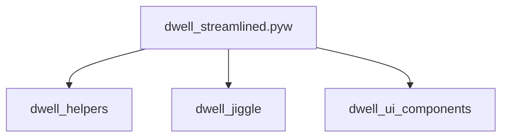

# 🧩 PROJECT STRUCTURE SUMMARY
**Generated:** 2025-10-24 20:48:26

This document provides a full architectural map of the project.

## 🧱 Module Dependency Graph



## 🔄 Cross-Module Data Flow Map

| Source Module | Target or Description |
|----------------|----------------------|
| dwell_helpers.py | Functions: _callback, distance_between_points, get_monitors, get_monitors_windows, load_settings, save_settings |
| dwell_jiggle.py | Functions: detect_jiggle, detect_jiggle_mode1_to_pause, detect_jiggle_pause_to_mode1 |
| dwell_streamlined.pyw | Functions: _on_hover_enter, _on_hover_leave, check_jiggle_cooldown, dwell_click, hide_drag_indicator, show_drag_indicator, signal_handler, stop_running, switch_mode, toggle_lock_pause, toggle_pause, toggle_pause... |
| dwell_ui_components.py | Functions: create_cursor_indicator, create_overlay_for_monitor, create_pause_indicator, hide_pause_indicator, on_hover_enter, on_hover_leave, show_pause_indicator, update_label, update_progress |

## 📦 Module Summaries

### `dwell_helpers.py`

**Intent:** Handles, retrieves, stores core behaviors for this module, derived from its primary routines.

**Classes:** _None_

**Functions:** _callback, distance_between_points, get_monitors, get_monitors_windows, load_settings, save_settings

**Globals:** MONITORENUMPROC, SETTINGS_FILE, SM_CXVIRTUALSCREEN, SM_CYVIRTUALSCREEN, SM_XVIRTUALSCREEN, SM_YVIRTUALSCREEN, cb, defaults, hdc, height, hmonitor, left, lparam, lprect, monitors, rect, saved, top, user32, width


**Local Imports:** _None_

**External Imports:** ctypes, json, os, sys, time


#### File I/O Summary

- Reads: json.load(...)

- Writes: json.dump(...)


#### Threading & UI Bindings

- Threads: _None_

- UI Binds: _None_


#### Exception Paths

_No exception handlers detected._


---

### `dwell_jiggle.py`

**Intent:** Identifies core behaviors for this module, derived from its primary routines.

**Classes:** _None_

**Functions:** detect_jiggle, detect_jiggle_mode1_to_pause, detect_jiggle_pause_to_mode1

**Globals:** all_x, all_y, center_x, center_y, distance, jig, max_distance_from_center, now, recent_positions, xchg, ychg


**Local Imports:** _None_

**External Imports:** time


#### File I/O Summary

- Reads: _None_

- Writes: _None_


#### Threading & UI Bindings

- Threads: _None_

- UI Binds: _None_


#### Exception Paths

_No exception handlers detected._


---

### `dwell_streamlined.pyw`

**Intent:** Handles core behaviors for this module, derived from its primary routines.

**Classes:** _None_

**Functions:** _on_hover_enter, _on_hover_leave, check_jiggle_cooldown, dwell_click, hide_drag_indicator, show_drag_indicator, signal_handler, stop_running, switch_mode, toggle_lock_pause, toggle_pause, toggle_pause_state, unified_pause_toggle, update_drag_indicator_position

**Globals:** COLOR_MODE_1, COLOR_MODE_2, CONFIG_MENU_HOTKEY, DRAG_RELEASE_TIME, DWELL_TIME, GRACE_STATIONARY_TIME, JIGGLE_MODE1_TO_PAUSE_AREA, JIGGLE_MODE1_TO_PAUSE_SENSITIVITY, JIGGLE_MODE1_TO_PAUSE_TIME, JIGGLE_PAUSE_TO_MODE1_AREA, JIGGLE_PAUSE_TO_MODE1_SENSITIVITY, JIGGLE_PAUSE_TO_MODE1_TIME, LOCK_PAUSE_HOTKEY, MONITORS, MOVEMENT_THRESHOLD, PAUSE_HOTKEY, STOP_HOTKEY, SWITCH_MODE_HOTKEY, TOGGLE_COOLDOWN, TOGGLE_CURSOR_BAR_HOTKEY, cooldown_end_time, current_drag_position, current_position, current_time, cursor_size, drag_end_position, dwell_position, dwell_start_time, elapsed, font_size, grace_last_position, grace_period_active, grace_stationary_start, jiggle_cooldown_active, jiggle_cooldown_start, last_click_position, last_drag_position, last_idle_position, last_stationary_position, last_toggle_time, lock_paused, master, mode, mode2_state, mouse, movement_distance, new_position, overlays, paused, recent_positions, running, settings, show_cursor_bar, start, stop_start, ui_height, ui_width


**Local Imports:** dwell_helpers, dwell_jiggle, dwell_ui_components

**External Imports:** keyboard, pyautogui, pynput.mouse, signal, sys, threading, time, tkinter


#### File I/O Summary

- Reads: _None_

- Writes: _None_


#### Threading & UI Bindings

- Threads: dwell_click

- UI Binds: _None_


#### Exception Paths

_No exception handlers detected._


---

### `dwell_ui_components.py`

**Intent:** Handles core behaviors for this module, derived from its primary routines.

**Classes:** _None_

**Functions:** create_cursor_indicator, create_overlay_for_monitor, create_pause_indicator, hide_pause_indicator, on_hover_enter, on_hover_leave, show_pause_indicator, update_label, update_progress

**Globals:** border_width, cursor_canvas, cursor_root, cursor_size, drag_indicator, fill, hover_state, lbl, pause_indicator_root, pause_label, pbar, pcan, progress_height, txt, win, x_pos, y_pos


**Local Imports:** _None_

**External Imports:** pyautogui, queue, time, tkinter


#### File I/O Summary

- Reads: _None_

- Writes: _None_


#### Threading & UI Bindings

- Threads: _None_

- UI Binds: <Enter>, <Leave>


#### Exception Paths

_No exception handlers detected._


---

## 🧠 DATA SCHEMA SUMMARY

```json
{
  "ModuleSummary": {
    "file": "str",
    "classes": ["list[str]"],
    "functions": ["list[str]"],
    "globals": ["list[str]"],
    "imports_local": ["list[str]"],
    "imports_external": ["list[str]"],
    "io_reads": ["list[str]"],
    "io_writes": ["list[str]"],
    "threads": ["list[str]"],
    "ui_binds": ["list[str]"],
    "exceptions": ["list[str]"],
    "intent": "str"
  }
}
```
