# 🧩 PROJECT STRUCTURE SUMMARY
**Generated:** 2025-10-24 23:31:37

This document provides a full architectural map of the project.

## 🧱 Module Dependency Graph

```mermaid
graph TD
    __init__.py --> behavioral_analysis
    __init__.py --> core_analyzer
    __init__.py --> file_io
    __init__.py --> intent_inference
    __init__.py --> synopsis_renderer
    __init__.py --> utils
    batch_annotate_modular.py --> analyzer_state
    batch_annotate_modular.py --> behavioral_analysis
    batch_annotate_modular.py --> core_analyzer
    batch_annotate_modular.py --> intent_inference
    batch_annotate_modular.py --> project_architect
    batch_annotate_modular.py --> state_tracker
    batch_annotate_modular.py --> synopsis_renderer
    core_analyzer.py --> analyzer_state
    core_analyzer.py --> state_machine_detector
    file_io.py --> behavioral_analysis
    file_io.py --> core_analyzer
    file_io.py --> synopsis_renderer
    intent_enhancer_v2.py --> intent_inference
    intent_inference.py --> intent_enhancer_v2
    main.py --> analyzer_state
```



## 🔄 Cross-Module Data Flow Map

| Source Module | Target or Description |
|----------------|----------------------|
| analyzer_state.py | Functions: clear, merge, new_state, summary, to_dict, to_json, update |
| batch_annotate_modular.py | Functions: __init__, _build_ui, _process_folder, _process_single, _run, compute_code_hash, extract_existing_hash, find_python_files, format_duration, generate_markdown, get_code_body, is_up_to_date, log, make_ba... |
| behavioral_analysis.py | Functions: __init__, analyze_function_dependencies, analyze_high_priority_functions, build_machine_block, categorize_shared_state, dfs, generate_behavioral_summary, group_modules_generic, render_call_hierarchy, ... |
| core_analyzer.py | Functions: __init__, _analyze_function_accesses, _call_to_name, _collect_params, _enclosing_function_name, _enter_func, _exit_func, _extract_open_args, _format_call_name, _is_local_module, _is_true_global, _name... |
| file_io.py | Functions: __init__, analyze_file, batch_analyze_files, create_annotated_file, get_analysis_summary, main, select_file_and_analyze |
| intent_enhancer_v2.py | Functions: __init__, detect_domains, detect_function_patterns, extract_noun_from_functions, find_common_themes, generate_enhanced_module_intent, generate_smart_intent |
| intent_inference.py | Functions: _infer_verb, _insert_human_readable_intent, _insert_machine_block_kv, _noun_phrase_from, _split_ident, generate_module_intent, infer_function_intent, inject_intent |
| main.py | Functions: analyze_file, batch_analyze, main |
| project_architect.py | Functions: build_project_summary, detect_exceptions, extract, extract_list |
| state_machine_detector.py | Functions: __init__, _analyze_transitions, _build_function_map, _classify_state_variable, _detect_guards, _detect_state_variables, _extract_name, _extract_value, _get_enclosing_function, _group_into_state_machin... |
| state_tracker.py | Functions: _strip_comment_prefix, append_to_project_structure, build_state_table, extract_blocks, extract_critical_globals, generate_state_markdown, merge_file_state_from_text, parse_block |
| synopsis_renderer.py | Functions: __init__, _render_classes, _render_critical_globals, _render_data_flow_summary, _render_function_behavioral_summaries, _render_function_dependencies, _render_function_signatures, _render_high_priority... |
| utils.py | Functions: call_to_name, categorize_shared_state, enclosing_function_name, extract_hotkey_bindings, extract_open_args, format_call_name, format_file_size, get_file_info, group_functions_by_purpose, is_local_modu... |

## 📦 Module Summaries

### `__init__.py`

**Intent:** Handles init functionality.

**Classes:** _None_

**Functions:** _None_

**Globals:** __all__, __author__, __version__


**Local Imports:** behavioral_analysis, core_analyzer, file_io, intent_inference, synopsis_renderer, utils

**External Imports:** importlib, sys


#### File I/O Summary

- Reads: _None_

- Writes: _None_


#### Threading & UI Bindings

- Threads: _None_

- UI Binds: _None_


#### Exception Paths

_No exception handlers detected._


---

### `analyzer_state.py`

**Intent:** Manages concurrent execution.

**Classes:** AnalyzerState

**Functions:** clear, merge, new_state, summary, to_dict, to_json, update

**Globals:** _lock, classes, config_state, exceptions, functions, generated_at, globals, hotkeys, imports_external, imports_local, io_reads, io_writes, notes, position_state, project_path, state, state_cats, threads, timing_state, ui_binds, version


**Local Imports:** _None_

**External Imports:** __future__, dataclasses, datetime, json, threading, typing


#### File I/O Summary

- Reads: _None_

- Writes: json.dump(...)


#### Threading & UI Bindings

- Threads: _None_

- UI Binds: _None_


#### Exception Paths

_No exception handlers detected._


---

### `batch_annotate_modular.py`

**Intent:** Creates and manages user interface components. Processes various components.

**Classes:** AnnotatorGUI

**Functions:** __init__, _build_ui, _process_folder, _process_single, _run, compute_code_hash, extract_existing_hash, find_python_files, format_duration, generate_markdown, get_code_body, is_up_to_date, log, make_backup, open_folder, open_folder_in_explorer, process_batch, process_single_file, run_batch, run_in_thread, run_single, select_file, select_folder, strip_all_annotations

**Globals:** ANNOTATOR_VERSION, HEADER_BOUNDARY, app, args, files, parser, project_structure_path, root, state_map, state_table


**Local Imports:** analyzer_state, behavioral_analysis, core_analyzer, intent_inference, project_architect, state_tracker, synopsis_renderer

**External Imports:** argparse, datetime, glob, hashlib, os, pathlib, shutil, subprocess, sys, threading, tkinter


#### File I/O Summary

- Reads: _None_

- Writes: _None_


#### Threading & UI Bindings

- Threads: fn

- UI Binds: _None_


#### Exception Paths

_No exception handlers detected._


---

### `behavioral_analysis.py`

**Intent:** Renders, Analyzes functionality for this module.

**Classes:** BehavioralAnalyzer

**Functions:** __init__, analyze_function_dependencies, analyze_high_priority_functions, build_machine_block, categorize_shared_state, dfs, generate_behavioral_summary, group_modules_generic, render_call_hierarchy, render_state_machines, render_ui_after_usage

**Globals:** _None_


**Local Imports:** _None_

**External Imports:** ast, collections, datetime, typing


#### File I/O Summary

- Reads: _None_

- Writes: _None_


#### Threading & UI Bindings

- Threads: _None_

- UI Binds: _None_


#### Exception Paths

_No exception handlers detected._


---

### `core_analyzer.py`

**Intent:** Locates or discovers, Extracts functionality for this module.

**Classes:** CodeAnalyzer, GlobalAccessVisitor, ScopeIndexer

**Functions:** __init__, _analyze_function_accesses, _call_to_name, _collect_params, _enclosing_function_name, _enter_func, _exit_func, _extract_open_args, _format_call_name, _is_local_module, _is_true_global, _names_in_target, _render_arg, _safe_unparse, analyze, analyze_classes, analyze_functions, build_call_graph, build_symbol_indexes, detect_state_machines, detect_ui_after_usage, extract_call_graph, extract_function_signatures, extract_hotkey_bindings, extract_state_transitions, find_file_io, find_globals, find_hotkeys_and_ui_binds, find_imports, find_threading, infer_function_behavior, map_global_accesses, parse_code, process_function, read_file, strip_existing_synopsis, summarize_initialization_sequence, visit_AnnAssign, visit_Assign, visit_AsyncFunctionDef, visit_AugAssign, visit_ExceptHandler, visit_For, visit_FunctionDef, visit_Global, visit_Import, visit_ImportFrom, visit_Name, visit_Nonlocal, visit_With

**Globals:** _None_


**Local Imports:** analyzer_state, state_machine_detector

**External Imports:** ast, collections, os, typing, warnings


#### File I/O Summary

- Reads: _None_

- Writes: _None_


#### Threading & UI Bindings

- Threads: _None_

- UI Binds: _None_


#### Exception Paths

_No exception handlers detected._


---

### `file_io.py`

**Intent:** Creates and manages user interface components. Creates various components.

**Classes:** FileIOHandler

**Functions:** __init__, analyze_file, batch_analyze_files, create_annotated_file, get_analysis_summary, main, select_file_and_analyze

**Globals:** _None_


**Local Imports:** behavioral_analysis, core_analyzer, synopsis_renderer

**External Imports:** os, sys, time, tkinter, traceback, typing


#### File I/O Summary

- Reads: _None_

- Writes: _None_


#### Threading & UI Bindings

- Threads: _None_

- UI Binds: _None_


#### Exception Paths

_No exception handlers detected._


---

### `intent_enhancer_v2.py`

**Intent:** Detects or identifies patterns in, Generates functionality for this module.

**Classes:** _None_

**Functions:** __init__, detect_domains, detect_function_patterns, extract_noun_from_functions, find_common_themes, generate_enhanced_module_intent, generate_smart_intent

**Globals:** DOMAIN_INDICATORS, DOMAIN_PURPOSES, FUNCTION_PATTERNS, MODULE_NAME_HINTS, analyzer1, analyzer2, analyzer3, analyzer4, analyzer5, analyzer6, analyzer7, analyzer8


**Local Imports:** intent_inference

**External Imports:** re, typing


#### File I/O Summary

- Reads: _None_

- Writes: _None_


#### Threading & UI Bindings

- Threads: _None_

- UI Binds: _None_


#### Exception Paths

_No exception handlers detected._


---

### `intent_inference.py`

**Intent:** Generates functionality for this module.

**Classes:** _None_

**Functions:** _infer_verb, _insert_human_readable_intent, _insert_machine_block_kv, _noun_phrase_from, _split_ident, generate_module_intent, infer_function_intent, inject_intent

**Globals:** ACTION_MAP, DEFAULT_MODULE_INTENT, DEFAULT_VERB


**Local Imports:** intent_enhancer_v2

**External Imports:** __future__, re, typing


#### File I/O Summary

- Reads: _None_

- Writes: _None_


#### Threading & UI Bindings

- Threads: _None_

- UI Binds: _None_


#### Exception Paths

_No exception handlers detected._


---

### `main.py`

**Intent:** Main application entry point and orchestration.

**Classes:** _None_

**Functions:** analyze_file, batch_analyze, main

**Globals:** _None_


**Local Imports:** analyzer_state

**External Imports:** code_synopsis_annotator.behavioral_analysis, code_synopsis_annotator.core_analyzer, code_synopsis_annotator.file_io, code_synopsis_annotator.synopsis_renderer, os, sys, typing


#### File I/O Summary

- Reads: _None_

- Writes: _None_


#### Threading & UI Bindings

- Threads: _None_

- UI Binds: _None_


#### Exception Paths

_No exception handlers detected._


---

### `project_architect.py`

**Intent:** Extracts, Detects or identifies patterns in functionality for this module.

**Classes:** _None_

**Functions:** build_project_summary, detect_exceptions, extract, extract_list

**Globals:** folder, path


**Local Imports:** _None_

**External Imports:** collections, datetime, os, re


#### File I/O Summary

- Reads: _None_

- Writes: _None_


#### Threading & UI Bindings

- Threads: _None_

- UI Binds: _None_


#### Exception Paths

_No exception handlers detected._


---

### `state_machine_detector.py`

**Intent:** Generates, Renders functionality for this module.

**Classes:** StateMachine, StateMachineDetector, StateTransition, StateVariable

**Functions:** __init__, _analyze_transitions, _build_function_map, _classify_state_variable, _detect_guards, _detect_state_variables, _extract_name, _extract_value, _get_enclosing_function, _group_into_state_machines, _infer_source_states, _matches_variable, detect, detect_state_machines, generate_mermaid_diagram, generate_state_machine_diagram, render_state_machine_summary, render_summary

**Globals:** STATE_VARIABLE_PATTERNS, analyzer, comparisons, condition, detector, from_state, line_number, name, primary_variable, readers, related_variables, results, states, test_code, to_state, transitions, trigger_function, values, var_type, writers


**Local Imports:** _None_

**External Imports:** ast, collections, dataclasses, re, typing


#### File I/O Summary

- Reads: _None_

- Writes: _None_


#### Threading & UI Bindings

- Threads: _None_

- UI Binds: _None_


#### Exception Paths

_No exception handlers detected._


---

### `state_tracker.py`

**Intent:** Loads and manages configuration settings. Extracts various components.

**Classes:** _None_

**Functions:** _strip_comment_prefix, append_to_project_structure, build_state_table, extract_blocks, extract_critical_globals, generate_state_markdown, merge_file_state_from_text, parse_block

**Globals:** BEGIN_MARK, BULLET_RE, CRIT_GLOBALS_HEADER, END_MARK, KEY_ALIASES, KEY_LINE_RE, VAR_HEADER_RE, folder, out_md, state


**Local Imports:** _None_

**External Imports:** datetime, json, os, pathlib, re, typing


#### File I/O Summary

- Reads: _None_

- Writes: _None_


#### Threading & UI Bindings

- Threads: _None_

- UI Binds: _None_


#### Exception Paths

_No exception handlers detected._


---

### `synopsis_renderer.py`

**Intent:** Generates functionality for this module.

**Classes:** SynopsisRenderer

**Functions:** __init__, _render_classes, _render_critical_globals, _render_data_flow_summary, _render_function_behavioral_summaries, _render_function_dependencies, _render_function_signatures, _render_high_priority_functions, _render_hotkeys, _render_integration_intent, _render_io_summary, _render_modularization_recommendations, _render_patch_additions, _render_shared_state, _render_state_machine_diagrams, _render_thread_interactions, _render_threading_analysis, generate_synopsis_header

**Globals:** _None_


**Local Imports:** _None_

**External Imports:** datetime, typing


#### File I/O Summary

- Reads: _None_

- Writes: _None_


#### Threading & UI Bindings

- Threads: _None_

- UI Binds: _None_


#### Exception Paths

_No exception handlers detected._


---

### `utils.py`

**Intent:** Utility functions and helper methods.

**Classes:** CodeUtils

**Functions:** call_to_name, categorize_shared_state, enclosing_function_name, extract_hotkey_bindings, extract_open_args, format_call_name, format_file_size, get_file_info, group_functions_by_purpose, is_local_module, safe_filename

**Globals:** _None_


**Local Imports:** _None_

**External Imports:** ast, os, re, typing


#### File I/O Summary

- Reads: _None_

- Writes: _None_


#### Threading & UI Bindings

- Threads: _None_

- UI Binds: _None_


#### Exception Paths

_No exception handlers detected._


---

## 🧠 DATA SCHEMA SUMMARY

```json
{
  "ModuleSummary": {
    "file": "str",
    "classes": ["list[str]"],
    "functions": ["list[str]"],
    "globals": ["list[str]"],
    "imports_local": ["list[str]"],
    "imports_external": ["list[str]"],
    "io_reads": ["list[str]"],
    "io_writes": ["list[str]"],
    "threads": ["list[str]"],
    "ui_binds": ["list[str]"],
    "exceptions": ["list[str]"],
    "intent": "str"
  }
}
```


---

# 🧩 SHARED STATE TABLE
**Generated:** 2025-10-24 23:31:37

| File | Variable | Modified By | Read By |
|------|-----------|-------------|---------|
| __init__.py | `CALLGRAPH_ROOTS` | - | - |
| __init__.py | `CLASSES` | - | - |
| __init__.py | `COMMAND_BINDS` | - | - |
| __init__.py | `FUNCTIONS` | - | - |
| __init__.py | `HOTKEYS` | - | - |
| __init__.py | `INIT_SEQUENCE` | - | - |
| __init__.py | `IO_READS` | - | - |
| __init__.py | `IO_WRITES` | - | - |
| __init__.py | `RETURNS` | - | - |
| __init__.py | `STATE_VARS` | - | - |
| __init__.py | `THREAD_TARGETS` | - | - |
| __init__.py | `TK_BINDS` | - | - |
| analyzer_state.py | `COMMAND_BINDS` | - | - |
| analyzer_state.py | `HOTKEYS` | - | - |
| analyzer_state.py | `IMPORTS_LOCAL` | - | - |
| analyzer_state.py | `INIT_SEQUENCE` | - | - |
| analyzer_state.py | `IO_READS` | - | - |
| analyzer_state.py | `THREAD_TARGETS` | - | - |
| analyzer_state.py | `TK_BINDS` | - | - |
| batch_annotate_modular.py | `COMMAND_BINDS` | - | - |
| batch_annotate_modular.py | `HOTKEYS` | - | - |
| batch_annotate_modular.py | `INIT_SEQUENCE` | - | - |
| batch_annotate_modular.py | `IO_READS` | - | - |
| batch_annotate_modular.py | `IO_WRITES` | - | - |
| batch_annotate_modular.py | `TK_BINDS` | - | - |
| batch_annotate_modular.py | `files` | _process_folder, find_python_files | _process_folder, find_python_files |
| batch_annotate_modular.py | `state_map` | _run, generate_markdown, process_single_file | _run, generate_markdown |
| batch_annotate_modular.py | `state_table` | _run, generate_markdown | _run, generate_markdown |
| behavioral_analysis.py | `COMMAND_BINDS` | - | - |
| behavioral_analysis.py | `GLOBALS` | - | - |
| behavioral_analysis.py | `HOTKEYS` | - | - |
| behavioral_analysis.py | `IMPORTS_LOCAL` | - | - |
| behavioral_analysis.py | `INIT_SEQUENCE` | - | - |
| behavioral_analysis.py | `IO_READS` | - | - |
| behavioral_analysis.py | `IO_WRITES` | - | - |
| behavioral_analysis.py | `STATE_VARS` | - | - |
| behavioral_analysis.py | `THREAD_TARGETS` | - | - |
| behavioral_analysis.py | `TK_BINDS` | - | - |
| core_analyzer.py | `COMMAND_BINDS` | - | - |
| core_analyzer.py | `GLOBALS` | - | - |
| core_analyzer.py | `HOTKEYS` | - | - |
| core_analyzer.py | `INIT_SEQUENCE` | - | - |
| core_analyzer.py | `IO_READS` | - | - |
| core_analyzer.py | `IO_WRITES` | - | - |
| core_analyzer.py | `THREAD_TARGETS` | - | - |
| core_analyzer.py | `TK_BINDS` | - | - |
| file_io.py | `COMMAND_BINDS` | - | - |
| file_io.py | `GLOBALS` | - | - |
| file_io.py | `HOTKEYS` | - | - |
| file_io.py | `INIT_SEQUENCE` | - | - |
| file_io.py | `IO_READS` | - | - |
| file_io.py | `IO_WRITES` | - | - |
| file_io.py | `STATE_VARS` | - | - |
| file_io.py | `THREAD_TARGETS` | - | - |
| file_io.py | `TK_BINDS` | - | - |
| intent_enhancer_v2.py | `CLASSES` | - | - |
| intent_enhancer_v2.py | `COMMAND_BINDS` | - | - |
| intent_enhancer_v2.py | `HOTKEYS` | - | - |
| intent_enhancer_v2.py | `INIT_SEQUENCE` | - | - |
| intent_enhancer_v2.py | `IO_READS` | - | - |
| intent_enhancer_v2.py | `IO_WRITES` | - | - |
| intent_enhancer_v2.py | `THREAD_TARGETS` | - | - |
| intent_enhancer_v2.py | `TK_BINDS` | - | - |
| intent_inference.py | `CLASSES` | - | - |
| intent_inference.py | `COMMAND_BINDS` | - | - |
| intent_inference.py | `HOTKEYS` | - | - |
| intent_inference.py | `INIT_SEQUENCE` | - | - |
| intent_inference.py | `IO_READS` | - | - |
| intent_inference.py | `IO_WRITES` | - | - |
| intent_inference.py | `THREAD_TARGETS` | - | - |
| intent_inference.py | `TK_BINDS` | - | - |
| main.py | `CLASSES` | - | - |
| main.py | `COMMAND_BINDS` | - | - |
| main.py | `GLOBALS` | - | - |
| main.py | `HOTKEYS` | - | - |
| main.py | `IO_READS` | - | - |
| main.py | `IO_WRITES` | - | - |
| main.py | `THREAD_TARGETS` | - | - |
| main.py | `TK_BINDS` | - | - |
| project_architect.py | `CLASSES` | - | - |
| project_architect.py | `COMMAND_BINDS` | - | - |
| project_architect.py | `HOTKEYS` | - | - |
| project_architect.py | `IMPORTS_LOCAL` | - | - |
| project_architect.py | `INIT_SEQUENCE` | - | - |
| project_architect.py | `IO_READS` | - | - |
| project_architect.py | `IO_WRITES` | - | - |
| project_architect.py | `THREAD_TARGETS` | - | - |
| project_architect.py | `TK_BINDS` | - | - |
| state_machine_detector.py | `COMMAND_BINDS` | - | - |
| state_machine_detector.py | `HOTKEYS` | - | - |
| state_machine_detector.py | `IMPORTS_LOCAL` | - | - |
| state_machine_detector.py | `INIT_SEQUENCE` | - | - |
| state_machine_detector.py | `IO_READS` | - | - |
| state_machine_detector.py | `IO_WRITES` | - | - |
| state_machine_detector.py | `THREAD_TARGETS` | - | - |
| state_machine_detector.py | `TK_BINDS` | - | - |
| state_machine_detector.py | `detector` | detect_state_machines, generate_state_machine_diagram, render_state_machine_summary | detect_state_machines, generate_state_machine_diagram, render_state_machine_summary |
| state_machine_detector.py | `from_state` | _analyze_transitions, generate_mermaid_diagram | _analyze_transitions, generate_mermaid_diagram |
| state_machine_detector.py | `to_state` | _analyze_transitions, generate_mermaid_diagram | _analyze_transitions, generate_mermaid_diagram |
| state_machine_detector.py | `var_type` | _analyze_transitions, _classify_state_variable, _detect_state_variables, generate_mermaid_diagram | _classify_state_variable, _detect_state_variables |
| state_tracker.py | `CLASSES` | - | - |
| state_tracker.py | `COMMAND_BINDS` | - | - |
| state_tracker.py | `HOTKEYS` | - | - |
| state_tracker.py | `IMPORTS_LOCAL` | - | - |
| state_tracker.py | `INIT_SEQUENCE` | - | - |
| state_tracker.py | `IO_READS` | - | - |
| state_tracker.py | `IO_WRITES` | - | - |
| state_tracker.py | `THREAD_TARGETS` | - | - |
| state_tracker.py | `TK_BINDS` | - | - |
| synopsis_renderer.py | `COMMAND_BINDS` | - | - |
| synopsis_renderer.py | `GLOBALS` | - | - |
| synopsis_renderer.py | `HOTKEYS` | - | - |
| synopsis_renderer.py | `IMPORTS_LOCAL` | - | - |
| synopsis_renderer.py | `INIT_SEQUENCE` | - | - |
| synopsis_renderer.py | `IO_READS` | - | - |
| synopsis_renderer.py | `IO_WRITES` | - | - |
| synopsis_renderer.py | `STATE_VARS` | - | - |
| synopsis_renderer.py | `THREAD_TARGETS` | - | - |
| synopsis_renderer.py | `TK_BINDS` | - | - |
| utils.py | `COMMAND_BINDS` | - | - |
| utils.py | `GLOBALS` | - | - |
| utils.py | `HOTKEYS` | - | - |
| utils.py | `IMPORTS_LOCAL` | - | - |
| utils.py | `INIT_SEQUENCE` | - | - |
| utils.py | `IO_READS` | - | - |
| utils.py | `IO_WRITES` | - | - |
| utils.py | `THREAD_TARGETS` | - | - |
| utils.py | `TK_BINDS` | - | - |