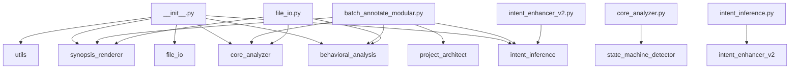

# 🧩 PROJECT STRUCTURE SUMMARY
**Generated:** 2025-10-24 22:17:13

This document provides a full architectural map of the project.

## 🧱 Module Dependency Graph



## 🔄 Cross-Module Data Flow Map

| Source Module | Target or Description |
|----------------|----------------------|
| batch_annotate_modular.py | Functions: __init__, _build_ui, _process_folder, _process_single, _run, compute_code_hash, extract_existing_hash, find_python_files, format_duration, generate_markdown, get_code_body, is_up_to_date, log, make_ba... |
| behavioral_analysis.py | Functions: __init__, analyze_function_dependencies, analyze_high_priority_functions, build_machine_block, categorize_shared_state, dfs, generate_behavioral_summary, group_modules_generic, render_call_hierarchy, ... |
| core_analyzer.py | Functions: __init__, _call_to_name, _enclosing_function_name, _extract_open_args, _format_call_name, _is_local_module, _render_arg, _safe_unparse, analyze, analyze_classes, analyze_functions, build_call_graph, d... |
| file_io.py | Functions: __init__, analyze_file, batch_analyze_files, create_annotated_file, get_analysis_summary, main, select_file_and_analyze |
| intent_enhancer_v2.py | Functions: __init__, detect_domains, detect_function_patterns, extract_noun_from_functions, find_common_themes, generate_enhanced_module_intent, generate_smart_intent |
| intent_inference.py | Functions: _infer_verb, _insert_human_readable_intent, _insert_machine_block_kv, _noun_phrase_from, _split_ident, generate_module_intent, infer_function_intent, inject_intent |
| main.py | Functions: analyze_file, batch_analyze, main |
| project_architect.py | Functions: build_project_summary, detect_exceptions, extract, extract_list |
| state_machine_detector.py | Functions: __init__, _analyze_transitions, _build_function_map, _classify_state_variable, _detect_guards, _detect_state_variables, _extract_name, _extract_value, _get_enclosing_function, _group_into_state_machin... |
| synopsis_renderer.py | Functions: __init__, _render_classes, _render_critical_globals, _render_data_flow_summary, _render_function_behavioral_summaries, _render_function_dependencies, _render_function_signatures, _render_high_priority... |
| utils.py | Functions: call_to_name, categorize_shared_state, enclosing_function_name, extract_hotkey_bindings, extract_open_args, format_call_name, format_file_size, get_file_info, group_functions_by_purpose, is_local_modu... |

## 📦 Module Summaries

### `__init__.py`

**Intent:** Handles init functionality.

**Classes:** _None_

**Functions:** _None_

**Globals:** __all__, __author__, __version__


**Local Imports:** behavioral_analysis, core_analyzer, file_io, intent_inference, synopsis_renderer, utils

**External Imports:** importlib, sys


#### File I/O Summary

- Reads: _None_

- Writes: _None_


#### Threading & UI Bindings

- Threads: _None_

- UI Binds: _None_


#### Exception Paths

_No exception handlers detected._


---

### `batch_annotate_modular.py`

**Intent:** Manages external processes. Processes various components.

**Classes:** AnnotatorGUI

**Functions:** __init__, _build_ui, _process_folder, _process_single, _run, compute_code_hash, extract_existing_hash, find_python_files, format_duration, generate_markdown, get_code_body, is_up_to_date, log, make_backup, open_folder, open_folder_in_explorer, process_batch, process_single_file, run_batch, run_in_thread, run_single, select_file, select_folder

**Globals:** ANNOTATOR_VERSION, HEADER_BOUNDARY, all_files, analyzer, app, args, backup_dir, backup_path, base_dir, behavioral_analyzer, btn_frame, category, code_body, code_hash, current_code, current_hash, duration, file, files, folder, frame, has_synopsis, header, header_lines, insert_at, lines, msg, opts, output, parser, path, rel_path, renderer, results, root, skip_patterns, start, stored_hash, synopsis_header, t, total, total_time, up_to_date, versioned_content


**Local Imports:** behavioral_analysis, core_analyzer, intent_inference, project_architect, synopsis_renderer

**External Imports:** argparse, datetime, glob, hashlib, os, pathlib, shutil, subprocess, sys, threading, tkinter


#### File I/O Summary

- Reads: _None_

- Writes: _None_


#### Threading & UI Bindings

- Threads: fn

- UI Binds: _None_


#### Exception Paths

_No exception handlers detected._


---

### `behavioral_analysis.py`

**Intent:** Renders, Analyzes functionality for this module.

**Classes:** BehavioralAnalyzer

**Functions:** __init__, analyze_function_dependencies, analyze_high_priority_functions, build_machine_block, categorize_shared_state, dfs, generate_behavioral_summary, group_modules_generic, render_call_hierarchy, render_state_machines, render_ui_after_usage

**Globals:** assigned, buckets, call_roots, cats, children, critical, fanout, fnames, globs, gr, gw, high_priority, indent, init_seq, lines, lname, num_machines, num_transitions, readers, results, sm, state_keys, trans, ts, ui_after, vals, writers


**Local Imports:** _None_

**External Imports:** ast, collections, datetime, typing


#### File I/O Summary

- Reads: _None_

- Writes: _None_


#### Threading & UI Bindings

- Threads: _None_

- UI Binds: _None_


#### Exception Paths

_No exception handlers detected._


---

### `core_analyzer.py`

**Intent:** Locates or discovers, Extracts functionality for this module.

**Classes:** CodeAnalyzer

**Functions:** __init__, _call_to_name, _enclosing_function_name, _extract_open_args, _format_call_name, _is_local_module, _render_arg, _safe_unparse, analyze, analyze_classes, analyze_functions, build_call_graph, detect_state_machines, detect_ui_after_usage, extract_call_graph, extract_function_signatures, extract_hotkey_bindings, extract_state_transitions, find_file_io, find_globals, find_hotkeys_and_ui_binds, find_imports, find_threading, infer_function_behavior, parse_code, process_function, read_file, strip_existing_synopsis, summarize_initialization_sequence

**Globals:** args, callee, candidate_pkg, candidate_py, cb, defaults_list, detector, enclosing, event, extra_calls, extra_transitions, found_end_marker, fullname, func, func_key, funcname, hk, info, kwarg_str, lines, methods, mode, module, node, parts, path, posonly, pretty, reads, regular_args, result, results, return_type, synopsis_end, transitions, vararg_str, writes


**Local Imports:** state_machine_detector

**External Imports:** ast, collections, os, typing, warnings


#### File I/O Summary

- Reads: _None_

- Writes: _None_


#### Threading & UI Bindings

- Threads: _None_

- UI Binds: _None_


#### Exception Paths

_No exception handlers detected._


---

### `file_io.py`

**Intent:** Creates and manages user interface components. Creates various components.

**Classes:** FileIOHandler

**Functions:** __init__, analyze_file, batch_analyze_files, create_annotated_file, get_analysis_summary, main, select_file_and_analyze

**Globals:** analyzer, annotated_code, behavioral_analyzer, filepath, handler, renderer, results, root, success, synopsis_header


**Local Imports:** behavioral_analysis, core_analyzer, synopsis_renderer

**External Imports:** os, sys, time, tkinter, traceback, typing


#### File I/O Summary

- Reads: _None_

- Writes: _None_


#### Threading & UI Bindings

- Threads: _None_

- UI Binds: _None_


#### Exception Paths

_No exception handlers detected._


---

### `intent_enhancer_v2.py`

**Intent:** Detects or identifies patterns in, Generates functionality for this module.

**Classes:** _None_

**Functions:** __init__, detect_domains, detect_function_patterns, extract_noun_from_functions, find_common_themes, generate_enhanced_module_intent, generate_smart_intent

**Globals:** DOMAIN_INDICATORS, DOMAIN_PURPOSES, FUNCTION_PATTERNS, MODULE_NAME_HINTS, action, action_words, analyzer1, analyzer2, analyzer3, analyzer4, analyzer5, analyzer6, analyzer7, analyzer8, base_lower, base_name, cleaned, domain_desc, domain_purpose, domains, filename, first_sentence, func_names, hint, imp_lower, imports_external, module_docstring, name_words, nouns, pattern_counts, pattern_descriptions, patterns, primary_domain, subject, subject_words, theme_str, themes, top_pattern, top_patterns, verbs, word_counts, words


**Local Imports:** intent_inference

**External Imports:** re, typing


#### File I/O Summary

- Reads: _None_

- Writes: _None_


#### Threading & UI Bindings

- Threads: _None_

- UI Binds: _None_


#### Exception Paths

_No exception handlers detected._


---

### `intent_inference.py`

**Intent:** Generates functionality for this module.

**Classes:** _None_

**Functions:** _infer_verb, _insert_human_readable_intent, _insert_machine_block_kv, _noun_phrase_from, _split_ident, generate_module_intent, infer_function_intent, inject_intent

**Globals:** ACTION_MAP, DEFAULT_MODULE_INTENT, DEFAULT_VERB, after, base, before, block, block_start, camel, end, end_idx, func_names, head, insert_at, intent, intents, lines, module_intent, obj_phrase, parts, phrase, safe_intent, safe_name, short, start_idx, tokens, updated, verbs


**Local Imports:** intent_enhancer_v2

**External Imports:** __future__, re, typing


#### File I/O Summary

- Reads: _None_

- Writes: _None_


#### Threading & UI Bindings

- Threads: _None_

- UI Binds: _None_


#### Exception Paths

_No exception handlers detected._


---

### `main.py`

**Intent:** Main application entry point and orchestration.

**Classes:** _None_

**Functions:** analyze_file, batch_analyze, main

**Globals:** analyzer, behavioral_analyzer, filepath, handler, renderer, result, results, success, summary


**Local Imports:** _None_

**External Imports:** code_synopsis_annotator.behavioral_analysis, code_synopsis_annotator.core_analyzer, code_synopsis_annotator.file_io, code_synopsis_annotator.synopsis_renderer, os, sys, typing


#### File I/O Summary

- Reads: _None_

- Writes: _None_


#### Threading & UI Bindings

- Threads: _None_

- UI Binds: _None_


#### Exception Paths

_No exception handlers detected._


---

### `project_architect.py`

**Intent:** Extracts, Detects or identifies patterns in functionality for this module.

**Classes:** _None_

**Functions:** build_project_summary, detect_exceptions, extract, extract_list

**Globals:** block, classes, content, data_flow, dependencies, exceptions, file_name, files, folder, functions, globals_, hotkeys, imports_external, imports_local, intent_line, io_reads, io_writes, lines, m, md, output, output_path, path, pattern, result, src_node, summaries, threads, tk_binds, val


**Local Imports:** _None_

**External Imports:** collections, datetime, os, re


#### File I/O Summary

- Reads: _None_

- Writes: _None_


#### Threading & UI Bindings

- Threads: _None_

- UI Binds: _None_


#### Exception Paths

_No exception handlers detected._


---

### `state_machine_detector.py`

**Intent:** Generates, Renders functionality for this module.

**Classes:** StateMachine, StateMachineDetector, StateTransition, StateVariable

**Functions:** __init__, _analyze_transitions, _build_function_map, _classify_state_variable, _detect_guards, _detect_state_variables, _extract_name, _extract_value, _get_enclosing_function, _group_into_state_machines, _infer_source_states, _matches_variable, detect, detect_state_machines, generate_mermaid_diagram, generate_state_machine_diagram, render_state_machine_summary, render_summary

**Globals:** STATE_VARIABLE_PATTERNS, all_values, analyzer, checked_values, clean_state, condition_checks_var, condition_str, current, detector, enclosing, from_state, from_states, left_name, lines, machine, parts, readers_str, related_transitions, results, source_states, states, test_code, to_state, trans_strs, trans_summary, transition, transitions_by_func, trigger, val, value, values_str, var_name, var_type, var_type_label, writers_str


**Local Imports:** _None_

**External Imports:** ast, collections, dataclasses, re, typing


#### File I/O Summary

- Reads: _None_

- Writes: _None_


#### Threading & UI Bindings

- Threads: _None_

- UI Binds: _None_


#### Exception Paths

_No exception handlers detected._


---

### `synopsis_renderer.py`

**Intent:** Generates functionality for this module.

**Classes:** SynopsisRenderer

**Functions:** __init__, _render_classes, _render_critical_globals, _render_data_flow_summary, _render_function_behavioral_summaries, _render_function_dependencies, _render_function_signatures, _render_high_priority_functions, _render_hotkeys, _render_integration_intent, _render_io_summary, _render_modularization_recommendations, _render_patch_additions, _render_shared_state, _render_state_machine_diagrams, _render_thread_interactions, _render_threading_analysis, generate_synopsis_header

**Globals:** args_str, behavior, critical, critical_vars, diagram, docstring, first_line, high_priority, inputs, intent, io_lines, joined, lines, outputs, parts, r, readers, reads, returns_str, rr, rv, rw, state_cats, summary, thr, w, writers, writes


**Local Imports:** _None_

**External Imports:** datetime, typing


#### File I/O Summary

- Reads: _None_

- Writes: _None_


#### Threading & UI Bindings

- Threads: _None_

- UI Binds: _None_


#### Exception Paths

_No exception handlers detected._


---

### `utils.py`

**Intent:** Utility functions and helper methods.

**Classes:** CodeUtils

**Functions:** call_to_name, categorize_shared_state, enclosing_function_name, extract_hotkey_bindings, extract_open_args, format_call_name, format_file_size, get_file_info, group_functions_by_purpose, is_local_module, safe_filename

**Globals:** assigned, base, buckets, candidate_pkg, candidate_py, cats, chain, cleaned, fnames, func, globs, hotkey, invalid_chars, lname, matches, mode, path, pattern, safe_name, stat


**Local Imports:** _None_

**External Imports:** ast, os, re, typing


#### File I/O Summary

- Reads: _None_

- Writes: _None_


#### Threading & UI Bindings

- Threads: _None_

- UI Binds: _None_


#### Exception Paths

_No exception handlers detected._


---

## 🧠 DATA SCHEMA SUMMARY

```json
{
  "ModuleSummary": {
    "file": "str",
    "classes": ["list[str]"],
    "functions": ["list[str]"],
    "globals": ["list[str]"],
    "imports_local": ["list[str]"],
    "imports_external": ["list[str]"],
    "io_reads": ["list[str]"],
    "io_writes": ["list[str]"],
    "threads": ["list[str]"],
    "ui_binds": ["list[str]"],
    "exceptions": ["list[str]"],
    "intent": "str"
  }
}
```
