# 🧩 PROJECT STRUCTURE SUMMARY
**Generated:** 2025-10-25 15:40:05

## 🚀 APPLICATION OVERVIEW

### Purpose
This application is designed to: Handles init functionality.

**Key Capabilities:**
- Loads and manages configuration settings.
- Creates and manages user interface components. Processes various components.
- Renders, Analyzes functionality for this module.

### Key Components
- **Entry Points**: `main.py`
- **Core Analysis**: `analyzer_state.py`, `behavioral_analysis.py`, `core_analyzer.py`
- **User Interface**: `synopsis_renderer.py`
- **Utilities**: `utils.py`

### Architecture Summary
- **Total Modules**: 15
- **Total Functions**: 190
- **Total Classes**: 13

### Key Features
- CSV Data Processing
- Code Analysis
- Content Generation
- Data Extraction
- Documentation Generation
- Pattern Detection
- User Interface

### 📄 Project Structure & Examples
**Example Module: `example.py`**
*Purpose: Loads and manages configuration settings.*

**Key Functions:**
- `clear`
- `merge`
- `new_state`

**Function Signatures:**
```python
AnalyzerState.clear(self) -> None
AnalyzerState.merge(self, other: AnalyzerState) -> None
AnalyzerState.summary(self) -> str
AnalyzerState.to_dict(self) -> Dict[str, Any]
AnalyzerState.to_json(self, path: str) -> None
```

**Project Statistics:**
- **Total Modules**: 15
- **Total Functions**: 190
- **Total Classes**: 13

---

## 🚪 ENTRY POINTS

### Primary Entry Points
- **`main.py`**: Main application entry point and orchestration.
  - Entry functions: `main()`

### Batch Processing Entry Points
- **`batch_annotate_modular.py`**: Creates and manages user interface components. Processes various components.
  - Batch functions: `_process_folder, _process_single, process_batch, process_single_file, run_batch()`

### Utility Scripts
- **`file_io.py`**: Creates and manages user interface components. Creates various components.
- **`intent_enhancer_v2.py`**: Detects or identifies patterns in, Generates functionality for this module.
- **`intent_enhancer_v2_backup.py`**: Detects or identifies patterns in, Generates functionality for this module.
- **`project_architect.py`**: Generates, Extracts functionality for this module.

### Execution Flow
1. **Start**: Run the main application
2. **Initialization**: Load configuration and dependencies
3. **Processing**: Execute core functionality
4. **Output**: Generate results or complete tasks

### Command Line Usage
```bash
# Run main application
python main.py
```

---

## 🔄 SHARED STATE TABLE

| File | Variable | Modified By | Read By |
|------|----------|-------------|---------|
| batch_annotate_modular.py | `files` | _process_folder, find_python_files, process_single_file | _process_folder, find_python_files |
| state_machine_detector.py | `detector` | detect_state_machines, generate_state_machine_diagram, render_state_machine_summary | detect_state_machines, generate_state_machine_diagram, render_state_machine_summary |
| state_machine_detector.py | `from_state` | _analyze_transitions, generate_mermaid_diagram | _analyze_transitions, generate_mermaid_diagram |
| state_machine_detector.py | `to_state` | _analyze_transitions, generate_mermaid_diagram | _analyze_transitions, generate_mermaid_diagram |
| state_machine_detector.py | `var_type` | _classify_state_variable, _detect_state_variables | _classify_state_variable, _detect_state_variables |

---

This document provides a full architectural map of the project.

## 🧱 Module Dependency Graph

```mermaid
graph TD
    __init__.py --> behavioral_analysis
    __init__.py --> core_analyzer
    __init__.py --> file_io
    __init__.py --> intent_inference
    __init__.py --> synopsis_renderer
    __init__.py --> utils
    batch_annotate_modular.py --> analyzer_state
    batch_annotate_modular.py --> behavioral_analysis
    batch_annotate_modular.py --> core_analyzer
    batch_annotate_modular.py --> intent_inference
    batch_annotate_modular.py --> project_architect
    batch_annotate_modular.py --> synopsis_renderer
    core_analyzer.py --> analyzer_state
    core_analyzer.py --> state_machine_detector
    file_io.py --> behavioral_analysis
    file_io.py --> core_analyzer
    file_io.py --> synopsis_renderer
    intent_enhancer_v2.py --> intent_inference
    intent_enhancer_v2_backup.py --> intent_inference
    intent_inference.py --> intent_enhancer_v2
    main.py --> analyzer_state
    project_architect.py --> state_tracker
```



## 🔄 Cross-Module Data Flow Map

| Source Module | Target or Description |
|----------------|----------------------|
| analyzer_state.py | Functions: clear, merge, new_state, summary, to_dict, to_json, update |
| batch_annotate_modular.py | Functions: __init__, _build_ui, _process_folder, _process_single, _run, compute_code_hash, extract_existing_hash, find_python_files, format_duration, generate_markdown, get_code_body, is_up_to_date, log, make_ba... |
| behavioral_analysis.py | Functions: __init__, analyze_function_dependencies, analyze_high_priority_functions, build_machine_block, categorize_shared_state, dfs, generate_behavioral_summary, group_modules_generic, render_call_hierarchy, ... |
| core_analyzer.py | Functions: __init__, _analyze_function_accesses, _call_to_name, _collect_params, _enclosing_function_name, _enter_func, _exit_func, _extract_open_args, _format_call_name, _is_local_module, _is_true_global, _name... |
| file_io.py | Functions: __init__, analyze_file, batch_analyze_files, create_annotated_file, get_analysis_summary, main, select_file_and_analyze |
| intent_enhancer_v2.py | Functions: __init__, detect_domains, detect_function_patterns, extract_noun_from_functions, find_common_themes, generate_enhanced_module_intent, generate_smart_intent |
| intent_enhancer_v2_backup.py | Functions: __init__, detect_domains, detect_function_patterns, extract_noun_from_functions, find_common_themes, generate_enhanced_module_intent, generate_smart_intent |
| intent_inference.py | Functions: _analyze_function_body, _enhance_with_type_hints, _infer_verb, _insert_human_readable_intent, _insert_machine_block_kv, _noun_phrase_from, _split_ident, generate_module_intent, infer_function_intent, ... |
| main.py | Functions: analyze_file, batch_analyze, main |
| project_architect.py | Functions: build_project_summary, detect_exceptions, extract, extract_function_signatures_from_content, extract_list, generate_application_overview, generate_detailed_shared_state_table, generate_entry_points_se... |
| state_machine_detector.py | Functions: __init__, _analyze_transitions, _build_function_map, _classify_state_variable, _detect_guards, _detect_state_variables, _extract_name, _extract_value, _get_enclosing_function, _group_into_state_machin... |
| state_tracker.py | Functions: _strip_comment_prefix, append_to_project_structure, build_state_table, extract_blocks, extract_critical_globals, generate_state_markdown, merge_file_state_from_text, parse_block |
| synopsis_renderer.py | Functions: __init__, _render_classes, _render_critical_globals, _render_data_flow_summary, _render_function_behavioral_summaries, _render_function_dependencies, _render_function_signatures, _render_high_priority... |
| utils.py | Functions: call_to_name, categorize_shared_state, enclosing_function_name, extract_hotkey_bindings, extract_open_args, format_call_name, format_file_size, get_file_info, group_functions_by_purpose, is_local_modu... |

## 📦 Module Summaries

### `__init__.py`

**Intent:** Handles init functionality.

**Classes:** _None_

**Functions:** _None_

**Globals:** __all__, __author__, __version__


**Local Imports:** behavioral_analysis, core_analyzer, file_io, intent_inference, synopsis_renderer, utils

**External Imports:** importlib, sys


#### 📝 Function Signatures

_No function signatures available._


#### 🎯 Function Intents

_No function intents available._


#### File I/O Summary

- Reads: _None_

- Writes: _None_


#### Threading & UI Bindings

- Threads: _None_

- UI Binds: _None_


#### Exception Paths

_No exception handlers detected._


---

### `analyzer_state.py`

**Intent:** Loads and manages configuration settings.

**Classes:** AnalyzerState

**Functions:** clear, merge, new_state, summary, to_dict, to_json, update

**Globals:** _lock, classes, config_state, exceptions, functions, generated_at, globals, hotkeys, imports_external, imports_local, io_reads, io_writes, notes, position_state, project_path, state, state_cats, threads, timing_state, ui_binds, version


**Local Imports:** _None_

**External Imports:** __future__, dataclasses, datetime, json, threading, typing


#### 📝 Function Signatures

- `AnalyzerState.clear(self) -> None`

- `AnalyzerState.merge(self, other: AnalyzerState) -> None`

- `AnalyzerState.summary(self) -> str`

- `AnalyzerState.to_dict(self) -> Dict[str, Any]`

- `AnalyzerState.to_json(self, path: str) -> None`

- `AnalyzerState.update(self, key: str, value: Any) -> None`

- `new_state(project_path: Optional[str] = None) -> AnalyzerState`


#### 🎯 Function Intents

- **clear()**: Reset all mutable fields.

- **merge()**: Merge another AnalyzerState into this one.

- **new_state()**: Factory to create a fresh state with an optional project path.

- **summary()**: A brief string summary for debugging or logging.

- **to_dict()**: A plain dictionary suitable for JSON serialization.

- **to_json()**: Serialize the state to a JSON file.

- **update()**: Thread-safe generic update helper.


#### File I/O Summary

- Reads: _None_

- Writes: json.dump(...)


#### Threading & UI Bindings

- Threads: _None_

- UI Binds: _None_


#### Exception Paths

_No exception handlers detected._


---

### `batch_annotate_modular.py`

**Intent:** Creates and manages user interface components. Processes various components.

**Classes:** AnnotatorGUI

**Functions:** __init__, _build_ui, _process_folder, _process_single, _run, compute_code_hash, extract_existing_hash, find_python_files, format_duration, generate_markdown, get_code_body, is_up_to_date, log, make_backup, open_folder, open_folder_in_explorer, process_batch, process_single_file, run_batch, run_in_thread, run_single, select_file, select_folder, strip_all_annotations

**Globals:** ANNOTATOR_VERSION, HEADER_BOUNDARY, app, args, files, parser, project_structure_path, root, state_map, state_table


**Local Imports:** analyzer_state, behavioral_analysis, core_analyzer, intent_inference, project_architect, synopsis_renderer

**External Imports:** argparse, datetime, glob, hashlib, os, pathlib, shutil, subprocess, sys, threading, tkinter


#### 📝 Function Signatures

- `AnnotatorGUI.__init__(self, root) -> None`

- `AnnotatorGUI._build_ui(self) -> None`

- `AnnotatorGUI._process_folder(self, folder) -> None`

- `AnnotatorGUI._process_single(self, path) -> None`

- `AnnotatorGUI.generate_markdown(self) -> None`

- `AnnotatorGUI.log(self, msg, tag = None) -> None`

- `AnnotatorGUI.open_folder(self) -> None`

- `AnnotatorGUI.run_batch(self) -> None`

- `AnnotatorGUI.run_in_thread(self, fn) -> None`

- `AnnotatorGUI.run_single(self) -> None`

- `AnnotatorGUI.select_file(self) -> None`

- `AnnotatorGUI.select_folder(self) -> None`

- `compute_code_hash(code_text: str) -> str`

- `extract_existing_hash(file_path: str) -> None`

- `find_python_files(directory_path, recursive = False, skip_patterns = None) -> None`

- `format_duration(seconds) -> None`

- `get_code_body(file_path: str) -> None`

- `is_up_to_date(file_path) -> None`

- `make_backup(file_path) -> None`

- `open_folder_in_explorer(path) -> None`

- `Open folder in file explorer (cross-platform).`

- `process_batch(files, dry_run = False, backup = True, skip_annotated = False, force_rewrite = False) -> None`

- `process_single_file(file_path, dry_run = False, backup = True, force_rewrite = False) -> None`

- `strip_all_annotations(file_path) -> None`


#### 🎯 Function Intents

- **__init__()**: Orchestrates multiple operations.

- **_build_ui()**: Iterates and processes items.

- **_process_folder()**: Iterates and processes items.

- **_process_single()**: Orchestrates multiple operations.

- **_run()**: Updates internal state.

- **compute_code_hash()**: Updates internal state.

- **extract_existing_hash()**: Reads data from file.

- **find_python_files()**: Iterates and processes items.

- **format_duration()**: Updates internal state.

- **generate_markdown()**: Orchestrates multiple operations.

- **get_code_body()**: Reads data from file.

- **is_up_to_date()**: Handles up to date.

- **log()**: Orchestrates multiple operations.

- **make_backup()**: Orchestrates multiple operations.

- **open_folder()**: Updates internal state.

- **open_folder_in_explorer()**: Open folder in file explorer (cross-platform).

- **process_batch()**: Iterates and processes items.

- **process_single_file()**: Writes data to file.

- **run_batch()**: Orchestrates multiple operations.

- **run_in_thread()**: Handles in thread.

- **run_single()**: Orchestrates multiple operations.

- **select_file()**: Updates internal state.

- **select_folder()**: Updates internal state.

- **strip_all_annotations()**: Completely remove all existing synopsis annotations from a file.


#### File I/O Summary

- Reads: _None_

- Writes: _None_


#### Threading & UI Bindings

- Threads: fn

- UI Binds: _None_


#### Exception Paths

_No exception handlers detected._


---

### `behavioral_analysis.py`

**Intent:** Renders, Analyzes functionality for this module.

**Classes:** BehavioralAnalyzer

**Functions:** __init__, analyze_function_dependencies, analyze_high_priority_functions, build_machine_block, categorize_shared_state, dfs, generate_behavioral_summary, group_modules_generic, render_call_hierarchy, render_state_machines, render_ui_after_usage

**Globals:** _None_


**Local Imports:** _None_

**External Imports:** ast, collections, datetime, typing


#### 📝 Function Signatures

- `BehavioralAnalyzer.__init__(self, analyzer, state = None) -> None`

- `BehavioralAnalyzer.analyze_function_dependencies(self) -> List[Tuple[str, List[str]]]`

- `Analyze functions with high fan-out (calling many other functions).`

- `BehavioralAnalyzer.analyze_high_priority_functions(self) -> List[Tuple[str, Dict, Set[str], Set[str]]]`

- `BehavioralAnalyzer.build_machine_block(self) -> List[str]`

- `BehavioralAnalyzer.categorize_shared_state(self) -> List[Tuple[str, List[str]]]`

- `BehavioralAnalyzer.generate_behavioral_summary(self) -> List[str]`

- `BehavioralAnalyzer.group_modules_generic(self) -> Dict[str, List[str]]`

- `BehavioralAnalyzer.render_call_hierarchy(self, max_depth: int = 3, max_children: int = 8) -> List[str]`

- `BehavioralAnalyzer.render_state_machines(self) -> List[str]`

- `BehavioralAnalyzer.render_ui_after_usage(self) -> List[str]`


#### 🎯 Function Intents

- **__init__()**: Initialize with reference to main analyzer and optional shared state.

- **analyze_function_dependencies()**: Analyze functions with high fan-out (calling many other functions).

- **analyze_high_priority_functions()**: Identify functions that modify multiple globals or are thread targets.

- **build_machine_block()**: Build the machine-readable data block.

- **categorize_shared_state()**: Categorize global variables by their likely purpose.

- **dfs()**: Iterates and processes items.

- **generate_behavioral_summary()**: Generate a comprehensive behavioral analysis summary.

- **group_modules_generic()**: Group functions into logical modules for refactoring suggestions.

- **render_call_hierarchy()**: Render a depth-limited call hierarchy.

- **render_state_machines()**: Render detected state machines with enhanced detection.

- **render_ui_after_usage()**: Render UI threading dependencies.


#### File I/O Summary

- Reads: _None_

- Writes: _None_


#### Threading & UI Bindings

- Threads: _None_

- UI Binds: _None_


#### Exception Paths

_No exception handlers detected._


---

### `core_analyzer.py`

**Intent:** Locates or discovers, Extracts functionality for this module.

**Classes:** CodeAnalyzer, GlobalAccessVisitor, ScopeIndexer

**Functions:** __init__, _analyze_function_accesses, _call_to_name, _collect_params, _enclosing_function_name, _enter_func, _exit_func, _extract_open_args, _format_call_name, _is_local_module, _is_true_global, _names_in_target, _render_arg, _safe_unparse, analyze, analyze_classes, analyze_functions, build_call_graph, build_symbol_indexes, detect_state_machines, detect_ui_after_usage, extract_call_graph, extract_function_signatures, extract_hotkey_bindings, extract_state_transitions, find_file_io, find_globals, find_hotkeys_and_ui_binds, find_imports, find_threading, infer_function_behavior, map_global_accesses, parse_code, process_function, read_file, strip_existing_synopsis, summarize_initialization_sequence, visit_AnnAssign, visit_Assign, visit_AsyncFunctionDef, visit_AugAssign, visit_ExceptHandler, visit_For, visit_FunctionDef, visit_Global, visit_Import, visit_ImportFrom, visit_Name, visit_Nonlocal, visit_With

**Globals:** _None_


**Local Imports:** analyzer_state, state_machine_detector

**External Imports:** ast, collections, os, typing, warnings


#### 📝 Function Signatures

- `CodeAnalyzer.__init__(self, filepath: str, state = None, *, include_machine_block: bool = True) -> None`

- `CodeAnalyzer._analyze_function_accesses(self, func_node: ast.AST, func_name: str) -> None`

- `CodeAnalyzer._call_to_name(self, func_node) -> str`

- `CodeAnalyzer._enclosing_function_name(self, node: ast.AST) -> Optional[str]`

- `CodeAnalyzer._extract_open_args(self, call_node: ast.Call) -> Tuple[Optional[str], str]`

- `Extract file path and mode from open() call.`

- `CodeAnalyzer._format_call_name(self, call_node: ast.Call) -> str`

- `CodeAnalyzer._is_local_module(self, module_name: str) -> bool`

- `CodeAnalyzer._render_arg(self, arg: ast.arg, default: Optional[ast.AST]) -> str`

- `CodeAnalyzer._safe_unparse(self, node: Optional[ast.AST]) -> str`

- `CodeAnalyzer.analyze(self) -> None`

- `CodeAnalyzer.analyze_classes(self) -> None`

- `CodeAnalyzer.analyze_functions(self) -> None`

- `CodeAnalyzer.build_call_graph(self) -> None`

- `CodeAnalyzer.build_symbol_indexes(self) -> None`

- `CodeAnalyzer.detect_state_machines(self) -> None`

- `CodeAnalyzer.detect_ui_after_usage(self) -> None`

- `CodeAnalyzer.extract_call_graph(self, tree: ast.AST) -> Dict[str, Set[str]]`

- `CodeAnalyzer.extract_function_signatures(self) -> None`

- `CodeAnalyzer.extract_hotkey_bindings(self) -> List[str]`

- `CodeAnalyzer.extract_state_transitions(self, tree: ast.AST) -> Dict[str, Set[str]]`

- `CodeAnalyzer.find_file_io(self) -> None`

- `CodeAnalyzer.find_globals(self) -> None`

- `CodeAnalyzer.find_hotkeys_and_ui_binds(self) -> None`

- `CodeAnalyzer.find_imports(self) -> None`

- `CodeAnalyzer.find_threading(self) -> None`

- `CodeAnalyzer.infer_function_behavior(self, func_name: str) -> Dict[str, object]`

- `CodeAnalyzer.map_global_accesses(self) -> None`

- `CodeAnalyzer.parse_code(self) -> None`

- `CodeAnalyzer.read_file(self) -> str`

- `CodeAnalyzer.strip_existing_synopsis(self, code: str) -> str`

- `CodeAnalyzer.summarize_initialization_sequence(self) -> None`

- `GlobalAccessVisitor.__init__(self, module_assigned: Set[str], module_imported: Set[str], func_params: Set[str], func_locals: Set[str], func_globals_declared: Set[str]) -> None`

- `GlobalAccessVisitor._is_true_global(self, name: str) -> bool`

- `GlobalAccessVisitor.visit_Name(self, node: ast.Name) -> None`

- `ScopeIndexer.__init__(self) -> None`

- `ScopeIndexer._collect_params(self, node: ast.AST) -> Set[str]`

- `ScopeIndexer._enter_func(self, name: str, node: ast.AST) -> None`

- `ScopeIndexer._exit_func(self) -> None`

- `ScopeIndexer.visit_AnnAssign(self, node: ast.AnnAssign) -> None`

- `ScopeIndexer.visit_Assign(self, node: ast.Assign) -> None`

- `ScopeIndexer.visit_AsyncFunctionDef(self, node: ast.AsyncFunctionDef) -> None`

- `ScopeIndexer.visit_AugAssign(self, node: ast.AugAssign) -> None`

- `ScopeIndexer.visit_ExceptHandler(self, node: ast.ExceptHandler) -> None`

- `ScopeIndexer.visit_For(self, node: ast.For) -> None`

- `ScopeIndexer.visit_FunctionDef(self, node: ast.FunctionDef) -> None`

- `ScopeIndexer.visit_Global(self, node: ast.Global) -> None`

- `ScopeIndexer.visit_Import(self, node: ast.Import) -> None`

- `ScopeIndexer.visit_ImportFrom(self, node: ast.ImportFrom) -> None`

- `ScopeIndexer.visit_Name(self, node: ast.Name) -> None`

- `ScopeIndexer.visit_Nonlocal(self, node: ast.Nonlocal) -> None`

- `ScopeIndexer.visit_With(self, node: ast.With) -> None`

- `_names_in_target(target: ast.AST) -> Set[str]`


#### 🎯 Function Intents

- **__init__()**: Initialize the analyzer with a file path and optional shared state.

- **_analyze_function_accesses()**: Populate reads/writes for a function using scope indexes.

- **_call_to_name()**: Convert a call function node to a string name.

- **_collect_params()**: Iterates and processes items.

- **_enclosing_function_name()**: Find the name of the function enclosing this node.

- **_enter_func()**: Handles func.

- **_exit_func()**: Handles func.

- **_extract_open_args()**: Extract file path and mode from open() call.

- **_format_call_name()**: Format a call node as a string.

- **_is_local_module()**: Check if a module is local to the project.

- **_is_true_global()**: Returns validation result.

- **_names_in_target()**: Extract all simple names bound by an assignment/target expression.

- **_render_arg()**: Render a function argument with its annotation and default.

- **_safe_unparse()**: Safely convert AST node to string; avoiding heavy operations.

- **analyze()**: Run the complete analysis pipeline.

- **analyze_classes()**: Analyze class definitions and their methods.

- **analyze_functions()**: Analyze function definitions and their behavior.

- **build_call_graph()**: Build a call graph of function calls.

- **build_symbol_indexes()**: Build scope indexes for this file's AST.

- **detect_state_machines()**: Detect state machine patterns using StateMachineDetector.

- **detect_ui_after_usage()**: Detect usage of UI after callbacks.

- **extract_call_graph()**: Extract call graph from AST.

- **extract_function_signatures()**: Extract function signatures with type hints and defaults.

- **extract_hotkey_bindings()**: Extract hotkey bindings in a pretty format.

- **extract_state_transitions()**: Extract state transitions from AST.

- **find_file_io()**: Find file I/O operations.

- **find_globals()**: Find all global variable assignments and references using proper scope analysis.

- **find_hotkeys_and_ui_binds()**: Find hotkey and UI binding patterns.

- **find_imports()**: Find and categorize imports.

- **find_threading()**: Find threading usage and interactions.

- **infer_function_behavior()**: Infer behavioral intent of a function.

- **map_global_accesses()**: Map which functions read and write each global variable.

- **parse_code()**: Parse the Python code into an AST.

- **process_function()**: Process a single function definition.

- **read_file()**: Read the source file.

- **strip_existing_synopsis()**: Remove existing synopsis headers from code.

- **summarize_initialization_sequence()**: Summarize module initialization sequence.

- **visit_AnnAssign()**: Handles ann assign.

- **visit_Assign()**: Iterates and processes items.

- **visit_AsyncFunctionDef()**: Handles async function def.

- **visit_AugAssign()**: Handles aug assign.

- **visit_ExceptHandler()**: Handles except handler.

- **visit_For()**: Iterates and processes items.

- **visit_FunctionDef()**: Handles function def.

- **visit_Global()**: Handles global.

- **visit_Import()**: Iterates and processes items.

- **visit_ImportFrom()**: Iterates and processes items.

- **visit_Name()**: Orchestrates multiple operations.

- **visit_Nonlocal()**: Handles nonlocal.

- **visit_With()**: Iterates and processes items.


#### File I/O Summary

- Reads: _None_

- Writes: _None_


#### Threading & UI Bindings

- Threads: _None_

- UI Binds: _None_


#### Exception Paths

_No exception handlers detected._


---

### `file_io.py`

**Intent:** Creates and manages user interface components. Creates various components.

**Classes:** FileIOHandler

**Functions:** __init__, analyze_file, batch_analyze_files, create_annotated_file, get_analysis_summary, main, select_file_and_analyze

**Globals:** _None_


**Local Imports:** behavioral_analysis, core_analyzer, synopsis_renderer

**External Imports:** os, sys, time, tkinter, traceback, typing


#### 📝 Function Signatures

- `FileIOHandler.__init__(self) -> None`

- `FileIOHandler.analyze_file(self, filepath: str) -> bool`

- `FileIOHandler.batch_analyze_files(self, filepaths: list) -> dict`

- `FileIOHandler.create_annotated_file(self, analyzer: CodeAnalyzer, output_path: str) -> None`

- `FileIOHandler.get_analysis_summary(self, analyzer: CodeAnalyzer) -> dict`

- `FileIOHandler.select_file_and_analyze(self) -> None`

- `main() -> None`


#### 🎯 Function Intents

- **__init__()**: Initialize the file I/O handler.

- **analyze_file()**: Analyze a specific file and create annotated version.

- **batch_analyze_files()**: Analyze multiple files in batch.

- **create_annotated_file()**: Create an annotated file with synopsis header.

- **get_analysis_summary()**: Get a summary of analysis results.

- **main()**: Main entry point for the application.

- **select_file_and_analyze()**: Select a file and run the complete analysis workflow.


#### File I/O Summary

- Reads: _None_

- Writes: _None_


#### Threading & UI Bindings

- Threads: _None_

- UI Binds: _None_


#### Exception Paths

_No exception handlers detected._


---

### `intent_enhancer_v2.py`

**Intent:** Detects or identifies patterns in, Generates functionality for this module.

**Classes:** _None_

**Functions:** __init__, detect_domains, detect_function_patterns, extract_noun_from_functions, find_common_themes, generate_enhanced_module_intent, generate_smart_intent

**Globals:** DOMAIN_INDICATORS, DOMAIN_PURPOSES, FUNCTION_PATTERNS, MODULE_NAME_HINTS, analyzer1, analyzer2, analyzer3, analyzer4, analyzer5, analyzer6, analyzer7, analyzer8


**Local Imports:** intent_inference

**External Imports:** re, typing


#### 📝 Function Signatures

- `detect_domains(imports_external: List[str]) -> Set[str]`

- `detect_function_patterns(function_names: List[str]) -> Dict[str, int]`

- `extract_noun_from_functions(function_names: List[str]) -> List[str]`

- `find_common_themes(nouns: List[str]) -> List[str]`

- `generate_enhanced_module_intent(analyzer, filename: Optional[str] = None, imports_external: Optional[List[str]] = None) -> str`

- `generate_smart_intent(analyzer) -> str`

- `Drop-in replacement for generate_module_intent() from intent_inference.py`


#### 🎯 Function Intents

- **__init__()**: Updates internal state.

- **detect_domains()**: Detect what domains this module operates in based on imports.

- **detect_function_patterns()**: Count how many functions match each pattern.

- **extract_noun_from_functions()**: Extract common noun phrases from function names.

- **find_common_themes()**: Find recurring themes in noun phrases.

- **generate_enhanced_module_intent()**: Enhanced intent generation using pattern matching and heuristics.

- **generate_smart_intent()**: Drop-in replacement for generate_module_intent() from intent_inference.


#### File I/O Summary

- Reads: _None_

- Writes: _None_


#### Threading & UI Bindings

- Threads: _None_

- UI Binds: _None_


#### Exception Paths

_No exception handlers detected._


---

### `intent_enhancer_v2_backup.py`

**Intent:** Detects or identifies patterns in, Generates functionality for this module.

**Classes:** _None_

**Functions:** __init__, detect_domains, detect_function_patterns, extract_noun_from_functions, find_common_themes, generate_enhanced_module_intent, generate_smart_intent

**Globals:** DOMAIN_INDICATORS, DOMAIN_PURPOSES, FUNCTION_PATTERNS, MODULE_NAME_HINTS, analyzer1, analyzer2, analyzer3, analyzer4, analyzer5, analyzer6, analyzer7, analyzer8


**Local Imports:** intent_inference

**External Imports:** re, typing


#### 📝 Function Signatures

- `detect_domains(imports_external: List[str]) -> Set[str]`

- `detect_function_patterns(function_names: List[str]) -> Dict[str, int]`

- `extract_noun_from_functions(function_names: List[str]) -> List[str]`

- `find_common_themes(nouns: List[str]) -> List[str]`

- `generate_enhanced_module_intent(analyzer, filename: Optional[str] = None, imports_external: Optional[List[str]] = None) -> str`

- `generate_smart_intent(analyzer) -> str`

- `Drop-in replacement for generate_module_intent() from intent_inference.py`


#### 🎯 Function Intents

- **__init__()**: Updates internal state.

- **detect_domains()**: Detect what domains this module operates in based on imports.

- **detect_function_patterns()**: Count how many functions match each pattern.

- **extract_noun_from_functions()**: Extract common noun phrases from function names.

- **find_common_themes()**: Find recurring themes in noun phrases.

- **generate_enhanced_module_intent()**: Enhanced intent generation using pattern matching and heuristics.

- **generate_smart_intent()**: Drop-in replacement for generate_module_intent() from intent_inference.


#### File I/O Summary

- Reads: _None_

- Writes: _None_


#### Threading & UI Bindings

- Threads: _None_

- UI Binds: _None_


#### Exception Paths

_No exception handlers detected._


---

### `intent_inference.py`

**Intent:** Generates functionality for this module.

**Classes:** _None_

**Functions:** _analyze_function_body, _enhance_with_type_hints, _infer_verb, _insert_human_readable_intent, _insert_machine_block_kv, _noun_phrase_from, _split_ident, generate_module_intent, infer_function_intent, inject_intent

**Globals:** ACTION_MAP, DEFAULT_MODULE_INTENT, DEFAULT_VERB


**Local Imports:** intent_enhancer_v2

**External Imports:** __future__, ast, re, typing


#### 📝 Function Signatures

- `_analyze_function_body(func_node: ast.FunctionDef) -> str`

- `_enhance_with_type_hints(func_name: str, func_node: ast.FunctionDef) -> str`

- `_infer_verb(tokens: List[str]) -> Tuple[str, str]`

- `_insert_human_readable_intent(header_text: str, human_intent: str) -> str`

- `Insert a '# INTENT: ...' line near the top (after SYNOPSIS_HASH if present).`

- `_insert_machine_block_kv(header_text: str, key: str, value: str) -> str`

- `_noun_phrase_from(tokens: List[str], skip_first: bool = True) -> str`

- `_split_ident(name: str) -> List[str]`

- `generate_module_intent(analyzer) -> str`

- `infer_function_intent(func_name: str, func_node: ast.FunctionDef = None) -> str`

- `inject_intent(header_text: str, analyzer, behavioral_analyzer) -> str`


#### 🎯 Function Intents

- **_analyze_function_body()**: Infer intent from function body patterns.

- **_enhance_with_type_hints()**: Enhance intent using return type hints.

- **_infer_verb()**: Iterates and processes items.

- **_insert_human_readable_intent()**: Insert a '# INTENT:.

- **_insert_machine_block_kv()**: Insert or update a key: value inside the MACHINE-READABLE DATA block.

- **_noun_phrase_from()**: Returns string representation.

- **_split_ident()**: Iterates and processes items.

- **generate_module_intent()**: Use function names and imports to synthesize a short module purpose line.

- **infer_function_intent()**: Generate function intent using priority cascade:.

- **inject_intent()**: Public entry point.


#### File I/O Summary

- Reads: _None_

- Writes: _None_


#### Threading & UI Bindings

- Threads: _None_

- UI Binds: _None_


#### Exception Paths

_No exception handlers detected._


---

### `main.py`

**Intent:** Main application entry point and orchestration.

**Classes:** _None_

**Functions:** analyze_file, batch_analyze, main

**Globals:** _None_


**Local Imports:** analyzer_state

**External Imports:** code_synopsis_annotator.behavioral_analysis, code_synopsis_annotator.core_analyzer, code_synopsis_annotator.file_io, code_synopsis_annotator.synopsis_renderer, os, sys, typing


#### 📝 Function Signatures

- `analyze_file(filepath: str, include_machine_block: bool = True) -> Optional[dict]`

- `batch_analyze(files: list, include_machine_block: bool = True) -> dict`

- `main() -> None`


#### 🎯 Function Intents

- **analyze_file()**: Analyze a single file and return results.

- **batch_analyze()**: Analyze multiple files in batch.

- **main()**: Main entry point for the code synopsis annotator.


#### File I/O Summary

- Reads: _None_

- Writes: _None_


#### Threading & UI Bindings

- Threads: _None_

- UI Binds: _None_


#### Exception Paths

_No exception handlers detected._


---

### `project_architect.py`

**Intent:** Generates, Extracts functionality for this module.

**Classes:** _None_

**Functions:** build_project_summary, detect_exceptions, extract, extract_function_signatures_from_content, extract_list, generate_application_overview, generate_detailed_shared_state_table, generate_entry_points_section, parse_function_intents

**Globals:** folder, path


**Local Imports:** state_tracker

**External Imports:** collections, datetime, os, re


#### 📝 Function Signatures

- `build_project_summary(folder: str, output_path: str = None) -> str`

- `detect_exceptions(content: str) -> list[str]`

- `extract(block: str, key: str) -> str`

- `extract_function_signatures_from_content(content: str) -> list[str]`

- `extract_list(block: str, key: str) -> list[str]`

- `generate_application_overview(summaries: list[dict]) -> list[str]`

- `generate_detailed_shared_state_table(folder: str) -> list[str]`

- `generate_entry_points_section(summaries: list[dict]) -> list[str]`

- `parse_function_intents(function_intents_str: str) -> dict[str, str]`


#### 🎯 Function Intents

- **build_project_summary()**: Scans annotated Python files; parses the MACHINE-READABLE DATA block; and.

- **detect_exceptions()**: Detect simple try/except exception handlers.

- **extract()**: Extract value for a given key from a MACHINE-READABLE DATA block.

- **extract_function_signatures_from_content()**: Extract function signatures from the FUNCTION SIGNATURES section.

- **extract_list()**: Extract comma-separated list for a key.

- **generate_application_overview()**: Generate an Application Overview section based on module intents and key components.

- **generate_detailed_shared_state_table()**: Generate a detailed Shared State Table using state_tracker functions.

- **generate_entry_points_section()**: Generate an Entry Points section showing how the application starts and flows.

- **parse_function_intents()**: Parse function intents from the FUNCTION_INTENTS string.


#### File I/O Summary

- Reads: _None_

- Writes: _None_


#### Threading & UI Bindings

- Threads: _None_

- UI Binds: _None_


#### Exception Paths

_No exception handlers detected._


---

### `state_machine_detector.py`

**Intent:** Generates, Renders functionality for this module.

**Classes:** StateMachine, StateMachineDetector, StateTransition, StateVariable

**Functions:** __init__, _analyze_transitions, _build_function_map, _classify_state_variable, _detect_guards, _detect_state_variables, _extract_name, _extract_value, _get_enclosing_function, _group_into_state_machines, _infer_source_states, _matches_variable, detect, detect_state_machines, generate_mermaid_diagram, generate_state_machine_diagram, render_state_machine_summary, render_summary

**Globals:** STATE_VARIABLE_PATTERNS, analyzer, comparisons, condition, detector, from_state, line_number, name, primary_variable, readers, related_variables, results, states, test_code, to_state, transitions, trigger_function, values, var_type, writers


**Local Imports:** _None_

**External Imports:** ast, collections, dataclasses, re, typing


#### 📝 Function Signatures

- `StateMachineDetector.__init__(self, analyzer) -> None`

- `StateMachineDetector._analyze_transitions(self) -> None`

- `Analyze state transitions (assignments to state variables).`

- `StateMachineDetector._build_function_map(self) -> None`

- `StateMachineDetector._classify_state_variable(self, var_name: str) -> Optional[str]`

- `StateMachineDetector._detect_guards(self) -> None`

- `Detect guard conditions (if statements checking state).`

- `StateMachineDetector._detect_state_variables(self) -> None`

- `StateMachineDetector._extract_name(self, node: ast.AST) -> Optional[str]`

- `StateMachineDetector._extract_value(self, node: ast.AST) -> Optional[str]`

- `StateMachineDetector._get_enclosing_function(self, node: ast.AST) -> Optional[str]`

- `StateMachineDetector._group_into_state_machines(self) -> None`

- `StateMachineDetector._infer_source_states(self, func_node: ast.FunctionDef, var_name: str, assignment_node: ast.Assign) -> List[str]`

- `StateMachineDetector._matches_variable(self, state_value: str, var_name: str) -> bool`

- `StateMachineDetector.detect(self) -> Dict[str, any]`

- `StateMachineDetector.generate_mermaid_diagram(self) -> str`

- `StateMachineDetector.render_summary(self) -> List[str]`

- `detect_state_machines(analyzer) -> Dict[str, any]`

- `generate_state_machine_diagram(analyzer) -> str`

- `render_state_machine_summary(analyzer) -> List[str]`


#### 🎯 Function Intents

- **__init__()**: Updates internal state.

- **_analyze_transitions()**: Analyze state transitions (assignments to state variables).

- **_build_function_map()**: Build a map of function names to their AST nodes.

- **_classify_state_variable()**: Classify if a variable name represents state.

- **_detect_guards()**: Detect guard conditions (if statements checking state).

- **_detect_state_variables()**: Detect variables that represent state.

- **_extract_name()**: Extract a variable name from an AST node.

- **_extract_value()**: Extract a constant value from an AST node.

- **_get_enclosing_function()**: Find the name of the function enclosing this node.

- **_group_into_state_machines()**: Group related state variables into state machines.

- **_infer_source_states()**: Infer possible source states by looking at preceding if conditions.

- **_matches_variable()**: Check if a state value relates to a variable.

- **detect()**: Run full state machine detection pipeline.

- **detect_state_machines()**: Detect state machines in the given analyzer's code.

- **generate_mermaid_diagram()**: Generate a Mermaid state diagram for detected state machines.

- **generate_state_machine_diagram()**: Generate a Mermaid state diagram for detected state machines.

- **render_state_machine_summary()**: Render a text summary of detected state machines for synopsis header.

- **render_summary()**: Render a text summary of detected state machines.


#### File I/O Summary

- Reads: _None_

- Writes: _None_


#### Threading & UI Bindings

- Threads: _None_

- UI Binds: _None_


#### Exception Paths

_No exception handlers detected._


---

### `state_tracker.py`

**Intent:** Loads and manages configuration settings. Extracts various components.

**Classes:** _None_

**Functions:** _strip_comment_prefix, append_to_project_structure, build_state_table, extract_blocks, extract_critical_globals, generate_state_markdown, merge_file_state_from_text, parse_block

**Globals:** BEGIN_MARK, BULLET_RE, CRIT_GLOBALS_HEADER, END_MARK, KEY_ALIASES, KEY_LINE_RE, VAR_HEADER_RE, folder, out_md, state


**Local Imports:** _None_

**External Imports:** datetime, json, os, pathlib, re, typing


#### 📝 Function Signatures

- `_strip_comment_prefix(line: str) -> str`

- `append_to_project_structure(project_folder: str, shared_state_md: str) -> None`

- `build_state_table(folder: str) -> Dict[str, Dict[str, Dict[str, List[str]]]]`

- `extract_blocks(text: str) -> List[str]`

- `extract_critical_globals(text: str) -> Dict[str, Dict[str, Set[str]]]`

- `generate_state_markdown(state_map: Dict[str, Dict[str, Dict[str, List[str]]]], output_path: str = None) -> str`

- `merge_file_state_from_text(file_path: str) -> Dict[str, Dict[str, Set[str]]]`

- `parse_block(block: str) -> Dict[str, Dict[str, Set[str]]]`


#### 🎯 Function Intents

- **_strip_comment_prefix()**: Remove leading '# ' or '#' and return trimmed content.

- **append_to_project_structure()**: Append the shared-state section to PROJECT_STRUCTURE.

- **build_state_table()**: Walk the folder and build:.

- **extract_blocks()**: All MACHINE-READABLE DATA blocks from a file's content.

- **extract_critical_globals()**: Parse the 'CRITICAL GLOBAL VARIABLES' section from a synopsis header.

- **generate_state_markdown()**: Create markdown for the Shared State Table.

- **merge_file_state_from_text()**: Parse both MACHINE-READABLE and CRITICAL GLOBAL VARIABLES sections.

- **parse_block()**: Parse one MACHINE-READABLE block into:.


#### File I/O Summary

- Reads: _None_

- Writes: _None_


#### Threading & UI Bindings

- Threads: _None_

- UI Binds: _None_


#### Exception Paths

_No exception handlers detected._


---

### `synopsis_renderer.py`

**Intent:** Generates functionality for this module.

**Classes:** SynopsisRenderer

**Functions:** __init__, _render_classes, _render_critical_globals, _render_data_flow_summary, _render_function_behavioral_summaries, _render_function_dependencies, _render_function_signatures, _render_high_priority_functions, _render_hotkeys, _render_integration_intent, _render_io_summary, _render_modularization_recommendations, _render_patch_additions, _render_shared_state, _render_state_machine_diagrams, _render_thread_interactions, _render_threading_analysis, generate_synopsis_header

**Globals:** _None_


**Local Imports:** _None_

**External Imports:** datetime, typing


#### 📝 Function Signatures

- `SynopsisRenderer.__init__(self, analyzer, behavioral_analyzer, state = None) -> None`

- `SynopsisRenderer._render_classes(self) -> List[str]`

- `SynopsisRenderer._render_critical_globals(self) -> List[str]`

- `SynopsisRenderer._render_data_flow_summary(self) -> List[str]`

- `SynopsisRenderer._render_function_behavioral_summaries(self) -> List[str]`

- `SynopsisRenderer._render_function_dependencies(self) -> List[str]`

- `SynopsisRenderer._render_function_signatures(self) -> List[str]`

- `SynopsisRenderer._render_high_priority_functions(self) -> List[str]`

- `SynopsisRenderer._render_hotkeys(self) -> List[str]`

- `SynopsisRenderer._render_integration_intent(self) -> List[str]`

- `SynopsisRenderer._render_io_summary(self) -> List[str]`

- `SynopsisRenderer._render_modularization_recommendations(self) -> List[str]`

- `SynopsisRenderer._render_patch_additions(self) -> List[str]`

- `SynopsisRenderer._render_shared_state(self) -> List[str]`

- `SynopsisRenderer._render_state_machine_diagrams(self) -> List[str]`

- `SynopsisRenderer._render_thread_interactions(self) -> List[str]`

- `SynopsisRenderer._render_threading_analysis(self) -> List[str]`

- `SynopsisRenderer.generate_synopsis_header(self) -> str`


#### 🎯 Function Intents

- **__init__()**: Initialize with references to analyzers and optional shared state.

- **_render_classes()**: Render classes section.

- **_render_critical_globals()**: Render critical global variables section.

- **_render_data_flow_summary()**: Render semantic data flow summary.

- **_render_function_behavioral_summaries()**: Render function behavioral summaries section.

- **_render_function_dependencies()**: Render function dependencies section.

- **_render_function_signatures()**: Render function signatures with type hints and docstrings.

- **_render_high_priority_functions()**: Render high priority functions section.

- **_render_hotkeys()**: Render hotkey bindings section.

- **_render_integration_intent()**: Render integration intent and AI instructions.

- **_render_io_summary()**: Render external I/O summary.

- **_render_modularization_recommendations()**: Render modularization recommendations.

- **_render_patch_additions()**: Render patch additions for refined behavioral analysis.

- **_render_shared_state()**: Render shared state categories.

- **_render_state_machine_diagrams()**: Render Mermaid state machine diagrams if available.

- **_render_thread_interactions()**: Render thread interaction map.

- **_render_threading_analysis()**: Render threading analysis section.

- **generate_synopsis_header()**: Generate the complete synopsis header.


#### File I/O Summary

- Reads: _None_

- Writes: _None_


#### Threading & UI Bindings

- Threads: _None_

- UI Binds: _None_


#### Exception Paths

_No exception handlers detected._


---

### `utils.py`

**Intent:** Utility functions and helper methods.

**Classes:** CodeUtils

**Functions:** call_to_name, categorize_shared_state, enclosing_function_name, extract_hotkey_bindings, extract_open_args, format_call_name, format_file_size, get_file_info, group_functions_by_purpose, is_local_module, safe_filename

**Globals:** _None_


**Local Imports:** _None_

**External Imports:** ast, os, re, typing


#### 📝 Function Signatures

- `CodeUtils.call_to_name(func_node: ast.AST) -> str`

- `CodeUtils.categorize_shared_state(globals_found: Set[str]) -> List[Tuple[str, List[str]]]`

- `CodeUtils.enclosing_function_name(node: ast.AST, tree: ast.AST) -> Optional[str]`

- `CodeUtils.extract_hotkey_bindings(code: str) -> List[str]`

- `CodeUtils.extract_open_args(call: ast.Call) -> Tuple[Optional[str], str]`

- `Extract file path and mode from open() calls.`

- `CodeUtils.format_call_name(call: ast.Call) -> str`

- `CodeUtils.format_file_size(size_bytes: int) -> str`

- `CodeUtils.get_file_info(filepath: str) -> Dict[str, Any]`

- `CodeUtils.group_functions_by_purpose(functions: Dict[str, Any]) -> Dict[str, List[str]]`

- `CodeUtils.is_local_module(module_name: str, dirpath: str) -> bool`

- `CodeUtils.safe_filename(filename: str) -> str`


#### 🎯 Function Intents

- **call_to_name()**: Convert an AST function node to a string name.

- **categorize_shared_state()**: Categorize global variables by their likely purpose.

- **enclosing_function_name()**: Find the function that contains the given node.

- **extract_hotkey_bindings()**: Extract hotkey bindings from source text using regex.

- **extract_open_args()**: Extract file path and mode from open() calls.

- **format_call_name()**: Format a function call for display.

- **format_file_size()**: Format file size in human-readable format.

- **get_file_info()**: Get basic information about a file.

- **group_functions_by_purpose()**: Group functions into logical modules for refactoring suggestions.

- **is_local_module()**: Check if a module is local to the project.

- **safe_filename()**: Create a safe filename by removing or replacing invalid characters.


#### File I/O Summary

- Reads: unknown

- Writes: _None_


#### Threading & UI Bindings

- Threads: _None_

- UI Binds: _None_


#### Exception Paths

line 258: ['OSError']


---

## 🧠 DATA SCHEMA SUMMARY

```json
{
  "ModuleSummary": {
    "file": "str",
    "classes": ["list[str]"],
    "functions": ["list[str]"],
    "globals": ["list[str]"],
    "imports_local": ["list[str]"],
    "imports_external": ["list[str]"],
    "io_reads": ["list[str]"],
    "io_writes": ["list[str]"],
    "threads": ["list[str]"],
    "ui_binds": ["list[str]"],
    "exceptions": ["list[str]"],
    "intent": "str",
    "function_signatures": ["list[str]"],
    "function_intents": "str"
  }
}
```
